# Press kit — screen handoff

Every screen in the press-kit area, at desktop (1440×900) and mobile (390×844), with the
context needed to redraw it. Captured from seeded local data on the `feature/epk-ladder`
branch.

> Regenerating this, and the exact caveats on what the screenshots do and do not show, is at
> the [bottom](#regenerating-this).

## What the feature is

A band's public directory profile **is** its electronic press kit. There is no second `/epk`
URL to keep in sync: the page a booker browses at `{slug}.corvmc.org` is the one that comes
out of the printer.

The whole kit is **free for every act**. What a band site buys is presentation and volume — a
video section, more than one photo, themes, a custom domain. The rule is _information is free,
production values are paid_: a booker never pays to find out what an act needs on stage or who
to email.

Three surfaces, and the split between them is the design:

| Surface          | Where                                                        | Who sees it               |
| ---------------- | ------------------------------------------------------------ | ------------------------- |
| **The live EPK** | `/directory/bands/{slug}`, handed out as `{slug}.corvmc.org` | anyone                    |
| **The package**  | a `.zip` the band downloads and emails                       | whoever they send it to   |
| **The site**     | the premium microsite                                        | anyone, if they bought it |

**No contact detail of any kind is published.** Not an email, not a phone number. A stranger
reaches the act through a Turnstile-backed form, so there is nothing on the page for a scraper
to take. The named contacts exist — they just live in the package.

## Vocabulary a wireframe must use

These are the labels that differ from what is stored. They are what a redraw silently gets
wrong.

| On screen                  | In the database                             | Note                                                                                          |
| -------------------------- | ------------------------------------------- | --------------------------------------------------------------------------------------------- |
| **Act**                    | `group` where `kind = 'band'`               | The UI says "act" everywhere. There is no `band` table.                                       |
| **Press kit**              | `band_site.epk`                             | Was "Electronic Press Kit / EPK". Do not reintroduce the acronym; the nav row is "Press Kit". |
| **Highlights**             | `epk.achievements`                          |                                                                                               |
| **Where enquiries go**     | `directory_entry.contact`                   | Never rendered publicly. The label has to say so or a band assumes it is on display.          |
| **Something to listen to** | a streaming link in `directory_entry.links` | Ladder rung. Satisfied by any streaming platform, including ones with no in-page embed.       |
| **Who plays what**         | `group_member.position`                     |                                                                                               |
| **9 of 12 pieces**         | `EpkSection[]` from `epk-completeness.ts`   | "pieces", not "fields" or "steps".                                                            |
| **1 of 1**                 | `FREE_PRESS_PHOTOS`                         | The free photo allowance.                                                                     |
| **Band site**              | `band_site.tier = 'premium'`                | Never "premium account" — the tier belongs to the act, not the person.                        |
| A member's displayed name  | `group_member.alias ?? user.name`           | A stage name wins inside the act.                                                             |

## Demo logins

Both `password`.

| Account                      | Reaches                                                                                                                                                     |
| ---------------------------- | ----------------------------------------------------------------------------------------------------------------------------------------------------------- |
| `soloact@corvallismusic.org` | Owner of **wren-halloway** — a **free** act with a complete free press kit: 3 quotes, 3 highlights, a booking contact and 1 press photo. Ladder at 9 of 11. |
| `admin@corvallismusic.org`   | Staff, and owner of **thevoltagethieves** — a **premium** act with videos, 3 gallery photos, a themed microsite and a custom-CSS page.                      |

Signed out reaches the public directory and both public profiles.

## Route map

| Route                               | File                                           | Guard                                            |
| ----------------------------------- | ---------------------------------------------- | ------------------------------------------------ |
| `/directory`                        | `(public)/directory/+page.svelte`              | none                                             |
| `/directory/bands/[slug]`           | `(public)/directory/bands/[slug]/+page.svelte` | none; 404s unless `visibility = 'public'`        |
| `/member/directory/bands/[slug]`    | `member/directory/bands/[slug]/+page.svelte`   | `requireUser`                                    |
| `/band/[slug]`                      | `band/[slug]/+page.svelte`                     | `requireGroupRole('member', { allowStaff })`     |
| `/band/[slug]/edit`                 | `band/[slug]/edit/+page.svelte`                | `requireGroupRole('admin')`                      |
| `/band/[slug]/press-kit`            | `band/[slug]/press-kit/+page.svelte`           | `requireGroupRole('admin')` — free for every act |
| `/band/[slug]/subscription`         | `band/[slug]/subscription/+page.svelte`        | owner                                            |
| `/band/[slug]/page-editor`          | `band/[slug]/page-editor/+page.svelte`         | admin + `tier = 'premium'`                       |
| `/band-site/[slug]`                 | `band-site/[slug]/+page.svelte`                | `tier = 'premium'`; served at the subdomain      |
| `/band-site/[slug]/epk`             | `band-site/[slug]/epk/+page.svelte`            | same                                             |
| `GET /api/bands/[id]/press-kit.zip` | `api/bands/[id=uuid]/press-kit.zip/+server.ts` | `requireGroupRole('admin')`                      |

`/band/[slug]/page-editor/epk` **308s** to `/band/[slug]/press-kit`. It is in the help
articles and in the history of every band that opened it.

**Band Premium launched.** The `bandPremium` flag is gone and every premium surface below
answers on the band's tier alone. Every free surface must keep working for a free act — that
is a constraint on any redesign, not a detail.

---

## 1. Public band profile — free act

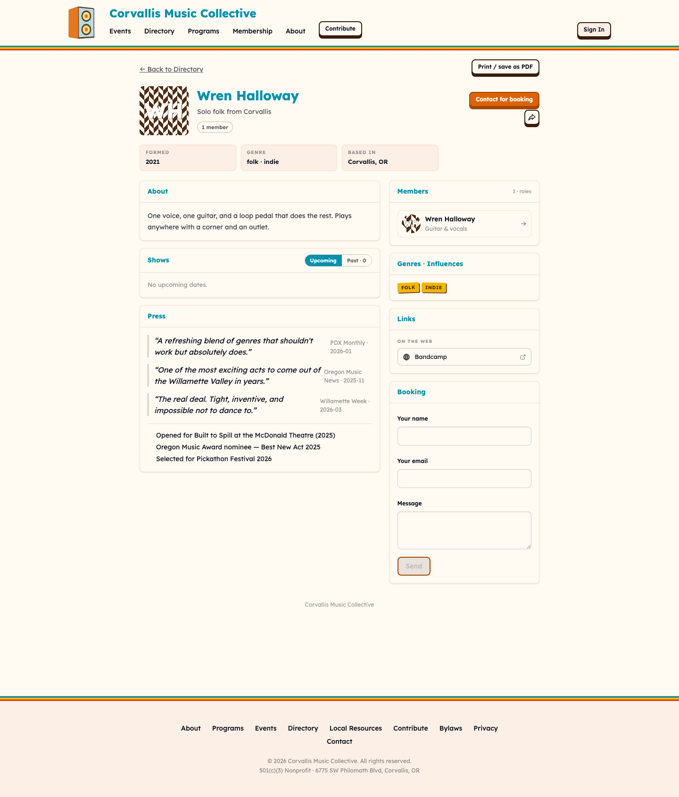
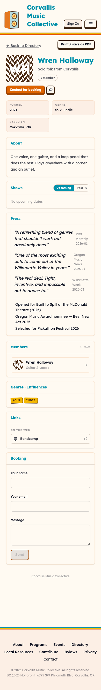

**Route** `/directory/bands/wren-halloway` · **File**
`src/routes/(public)/directory/bands/[slug]/+page.svelte` · **Guard** none · **Data**
`getPublicBandProfile` → `loadBandProfile`, one query returning the profile, the genres, the
public press kit and the photos.

A booker, a journalist or a curious stranger lands here from a flyer, a QR code or the act's
own `{slug}.corvmc.org`, usually while deciding whether to reply to an email or fill a slot.
It sits outside the app's navigation entirely — most visitors will never see the member site.
They read down: who the act is, what they sound like, when they are playing, and then either
print the page or send a message through the form at the bottom.

**User stories**

- As a venue booker, I want to hear the act and see their upcoming dates in one place, so I
  can decide without three tabs.
- As a listings editor, I want a printable page with a photo I can use, so I do not have to
  ask for a press kit.
- As a band member, I want one address to hand out that never goes stale.
- As a stranger, I want to contact the act without them having published an address that
  spam will find.

**What the fixtures show** — Wren Halloway, a solo act, at a complete free kit: 3 press
quotes, 3 highlights, 1 press photo, a Bandcamp link, one upcoming show, one member with an
instrument. The Press and Photos sections exist only because the seed fills them; see the
caveats.

**Known friction** _(open)_ — the print button sits in the top bar with the back link, which
reads as navigation rather than as the act's own affordance. _(open)_ — with one photo, the
Photos section is a single large image whose weight is out of proportion to a one-line
Highlights list beside it.

---

## 2. Public band profile — premium act

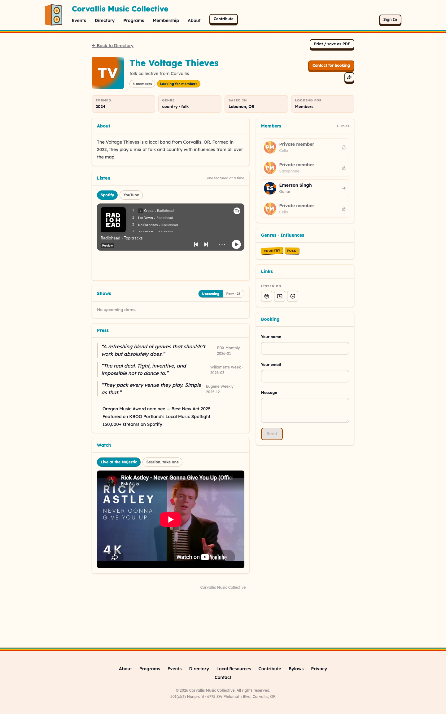
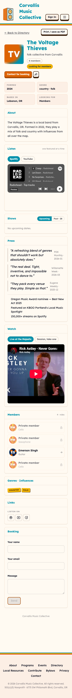

**Route** `/directory/bands/thevoltagethieves` · same file and guard as above.

The same page for an act that bought a band site. The difference is additive and small on
purpose: a **Watch** section of live video, and more than one photo. Everything structural is
identical, because the directory profile is not the thing premium buys.

**User stories**

- As a booker, I want to watch the act play before I reply.
- As a premium band, I want my extras to appear where people already look, not only on a
  microsite nobody has the URL for.

**What the fixtures show** — The Voltage Thieves with 2 seeded YouTube videos and 3 gallery
photos.

**Known friction** _(open)_ — Watch and Listen are two separate embedded players stacked in
the same column, and neither is obviously the primary one.

---

## 3. Directory index

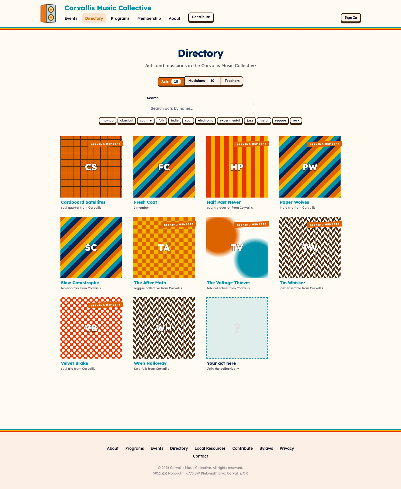
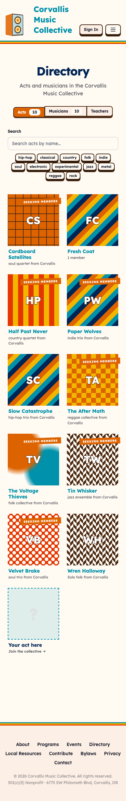

**Route** `/directory` · **File** `src/routes/(public)/directory/+page.svelte` · **Guard**
none · **Data** `getPublicDirectory`, loaded whole and faceted in the browser by
`directory-browse.ts`.

Where a profile is found by someone who does not already have its address. Included here
because it is the only entry point to screens 1 and 2 for a visitor with no link.

**User stories**

- As a visitor, I want to browse acts by genre and find one that fits a bill.
- As a member, I want to find bands looking for someone who plays what I play.

**What the fixtures show** — the seeded acts and members mixed in one directory.

**Known friction** _(open, from `social-prior-art.md`)_* — the intent data (`lookingFor`,
instruments) only populates filter chips a member must think to apply; the report's "match,
do not just filter" item is unbuilt.

---

## 4. Band dashboard — the ladder card

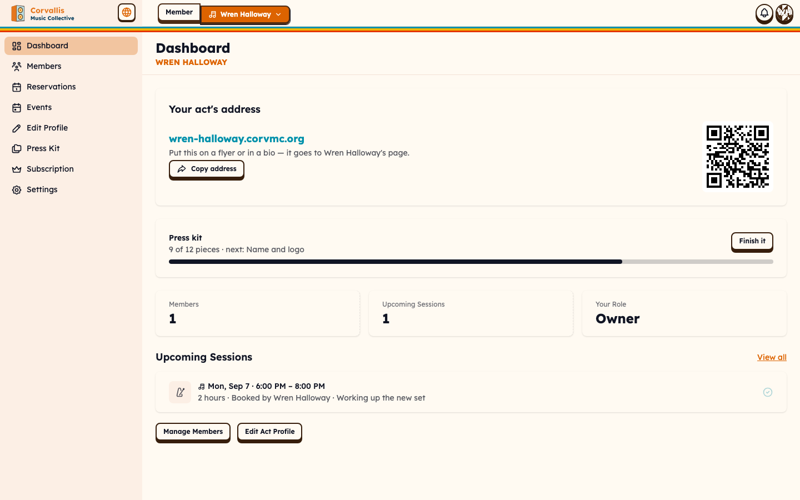
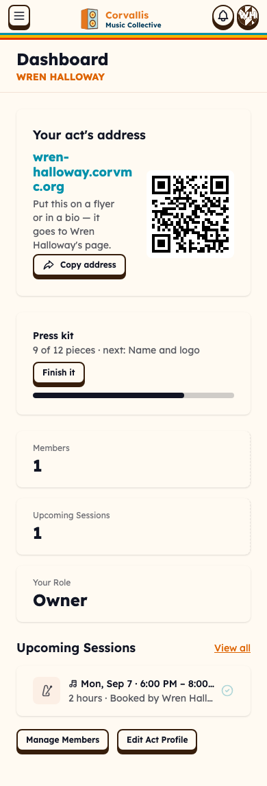

**Route** `/band/wren-halloway` · **File** `src/routes/band/[slug]/+page.svelte`, card in
`PressKitCard.svelte` · **Guard** `requireGroupRole('member', { allowStaff })`; the card is
owner/admin only · **Data** `getPressKitProgress`, behind its own boundary so the dashboard's
sessions do not wait on it.

The first thing a band member sees after choosing their act. The card is a compact form of
the ladder — a count, the next missing piece, and a way in. It exists because nothing
previously told a band that a press kit was something they had, let alone how far along it
was.

**User stories**

- As a band owner, I want to know at a glance whether my kit is ready to send.
- As a band owner, I want to be told the one next thing rather than handed a checklist.
- As a member, I do not want to see this at all — it is not my job.

**What the fixtures show** — 9 of 12, next: "Name and logo" (the act has no avatar).

**Known friction** _(open)_ — the card competes with the address card directly above it, and
both are "here is a thing you own" panels with similar weight.

---

## 5. Press-kit editor

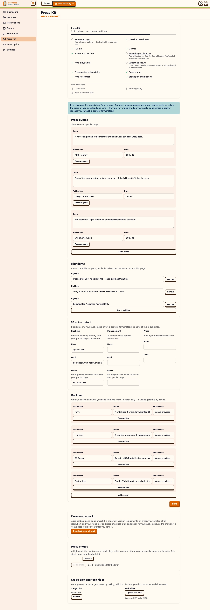
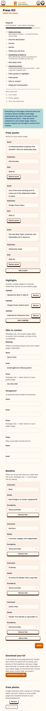

**Route** `/band/wren-halloway/press-kit` · **File**
`src/routes/band/[slug]/press-kit/+page.svelte` with `PressKitForm`, `ContactRoleFields` and
`PressPhotos` beside it · **Guard** `requireGroupRole('admin')`, **no flag** · **Data**
`getPressKitEditor` — one query carrying the kit, the media and the ladder.

Where the whole kit is written. Owner or admin, usually in one sitting when an act first
sets up and then rarely again. It is deliberately a separate page from Edit Profile because
the two have different readers: the profile is what the public sees, this is what a venue is
sent. The full ladder sits at the top, then public sections (quotes, highlights), then
the package-only section (contacts), then the download and the photos.

**User stories**

- As a band owner, I want to fill in my press kit without guessing which parts become public.
- As a band owner, I want to name a booking contact and know that is where enquiries land.
- As a band owner, I want to list what I need from the room once and send it every time.
- As an admin who is not the owner, I want to keep the kit current without billing access.

**What the fixtures show** — a complete free kit: 3 quotes with publications and dates, 3
highlights, a booking contact with a phone number, one press photo.
Management and Press contacts are deliberately empty, so the "role nobody filled" state is
visible.

**Known friction** _(open)_ — the page is long and the ladder at the top is the only
navigation; there are no in-page anchors, so "next: Press photo" means scrolling. _(open)_ —
public and package sections are distinguished only by their description text, not visually.

---

## 6. Press photos, at the free limit

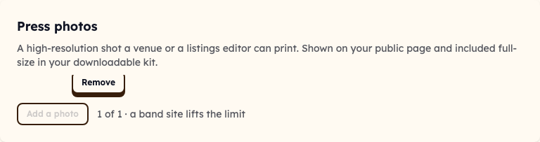
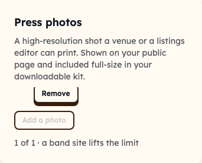

**Element** the Press photos card on the editor above.

The one state that proves `FREE_PRESS_PHOTOS` is enforced rather than merely declared: at one
photo, "Add a photo" is disabled and the upsell is stated inline — _1 of 1 · a band site lifts
the limit_. The cap is enforced server-side in the media route; this button is presentation.

**User stories**

- As a free band, I want to know the limit before I hit it, not after an upload fails.
- As a free band, I want the upsell to be a fact, not a nag.

**Known friction** _(open, visible in the shot)_ — the photo above the Remove button does not
render, leaving a naked control. Partly a fixture artifact (see caveats), but the layout has
**no placeholder or failed-image state**, so a real band with a slow or broken image sees a
Remove button attached to nothing. _(open)_ — Remove sits above the thumbnail rather than
under it, which reads as belonging to the section rather than the photo.

---

## 7. Act profile editor

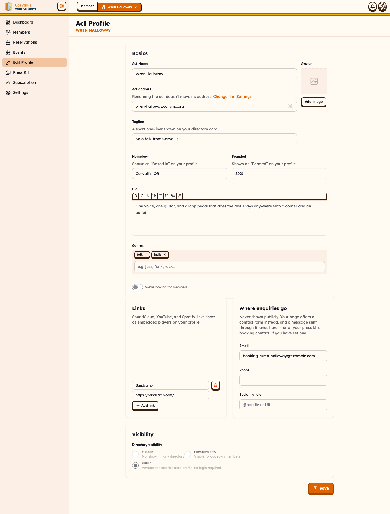
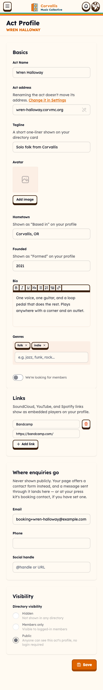

**Route** `/band/wren-halloway/edit` · **File** `band/[slug]/edit/+page.svelte` with
`BandProfileForm.svelte` · **Guard** `requireGroupRole('admin')` · **Data**
`getBandProfileEditor`.

The act's identity: name, bio, tagline, genres, links, visibility, and the address it is
reached at. Visited when an act is created and whenever something about it changes.

Note the **"Where enquiries go"** card. It was "Directory Contact Info" and those fields were
printed on the public page. They no longer are — they route the contact form instead — and the
card has to say so, or a band reads "contact info" and assumes it is on display.

**User stories**

- As a band owner, I want to change our bio without wondering whether the URL moves.
- As a band owner, I want to know where a message from my public page will land.
- As a band owner, I want to hide the act from the directory without deleting it.

**What the fixtures show** — a filled profile with a Bandcamp link and one genre.

**Known friction** _(fixed)_ — renaming an act used to move its address; it no longer does,
and the field says so. _(open)_ — "Act address" is read-only here and changed in Settings, so
the one page about identity cannot change the most identifying thing.

---

## 8. Subscription — the upsell

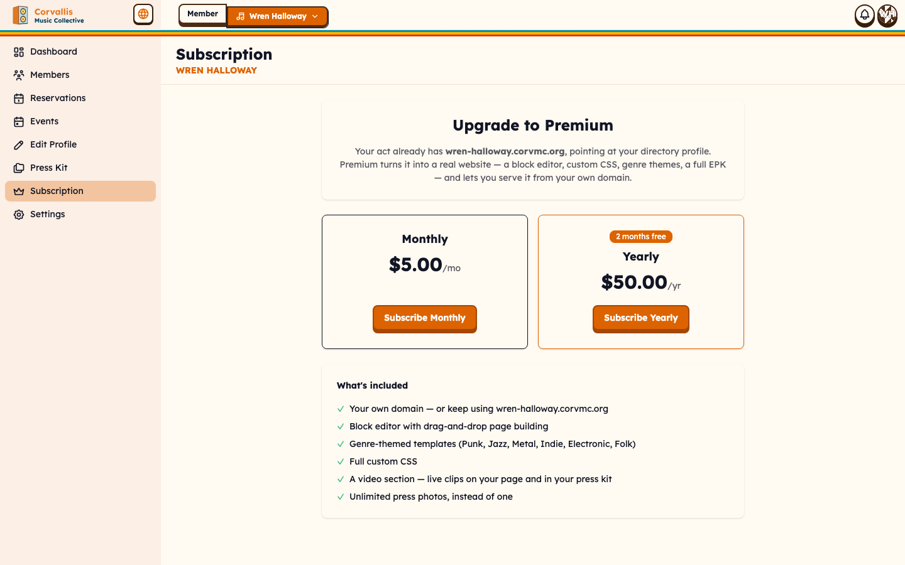
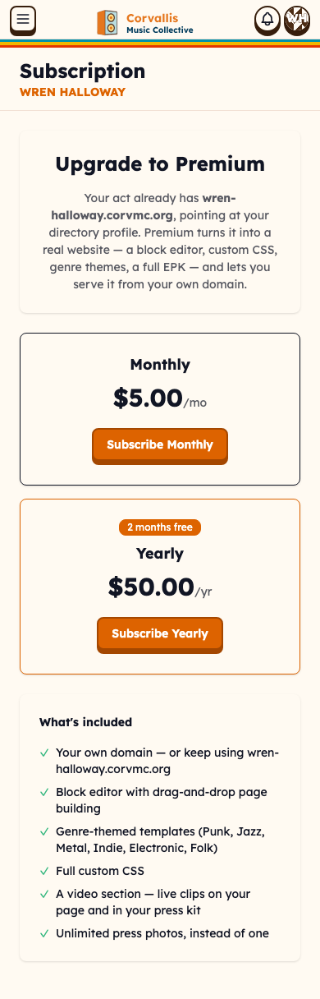

**Route** `/band/wren-halloway/subscription` · **Guard** owner.

What a band site costs and what it adds. Owner-only, because it is billing.

The feature list is the part that matters for a redesign: it used to sell the EPK, the photo
gallery and embedded players, **all three of which are now free**. It now sells a video
section, unlimited press photos, themes, custom CSS and a custom domain.

**User stories**

- As a band owner, I want to see what I get that I do not already have.
- As a band owner, I want the price and the billing interval before I commit.

**What the fixtures show** — $5/month, the free-tier state with an upgrade CTA.

**Known friction** _(open)_ — the list mixes things a visitor sees (video, photos) with
things only the band touches (custom CSS), with no grouping.

---

## 9. Press-kit editor — premium

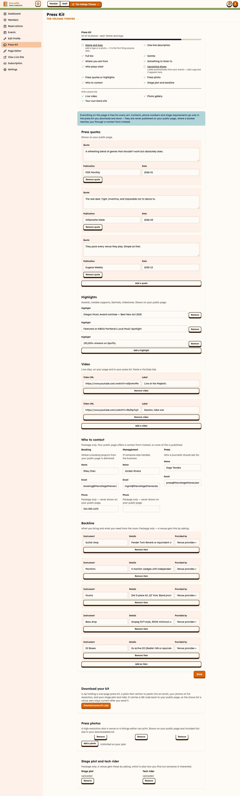
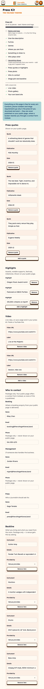

**Route** `/band/thevoltagethieves/press-kit` · same file and guard as screen 5.

The same editor for an act with a band site. One card is added — **Video**, capped at four —
and the photo cap is gone. Nothing is taken away or rearranged, which is the intent: premium
is additive.

**User stories**

- As a premium band, I want to add live clips where the rest of my kit already lives.
- As a premium band, I want to stop counting photos.

**What the fixtures show** — 2 seeded videos with labels, 3 gallery photos, a full kit.

**Known friction** _(open)_ — the Video card appears between the public and package sections
with nothing marking it as the paid one, so on a downgrade it would vanish without
explanation.

---

## 10. Page editor — theme, CSS and live preview

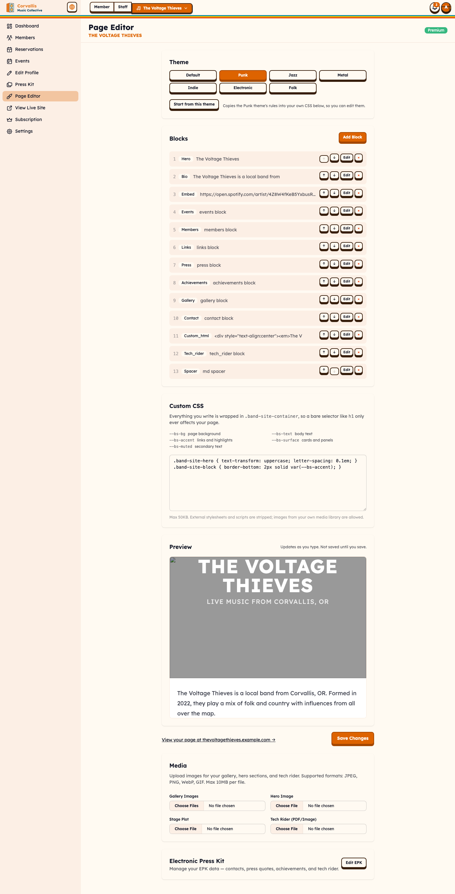
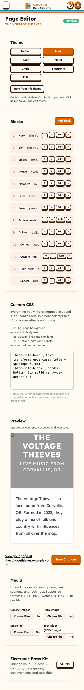

**Route** `/band/thevoltagethieves/page-editor` · **Guard** admin + premium + flag · **Data**
`getBandPageEditor`.

Where a band site is built: blocks, one of seven themes, and custom CSS. The redesign added
three things here, all aimed at making a theme a **starting point rather than a skin**:

- **Start from this theme** copies the theme's own rules into the band's CSS, commented.
- A **variable legend** naming `--bs-bg`, `--bs-text`, `--bs-accent`, `--bs-surface`,
  `--bs-muted` and the block hooks — nobody could guess them before.
- A **live preview** that re-renders as you type. Previously the only way to see a change was
  to save and open the site in another tab.

**User stories**

- As a band, I want to start from something that already looks like a band and change it.
- As a band, I want to see what my CSS does before I save it.
- As a band, I want to use a photo I uploaded as a background — which was impossible before,
  because our own media host counted as external and was blocked.

**What the fixtures show** — a premium act with a seeded theme, custom CSS and blocks.

**Known friction** _(open)_ — the CSS box is a bare `<textarea>`: no syntax highlighting, no
line numbers, no error surface when the sanitizer strips something. _(open)_ — the preview is
bounded at 32rem and scrolls independently, so on mobile it is a small window into a page.

---

## 11. Band site (microsite)

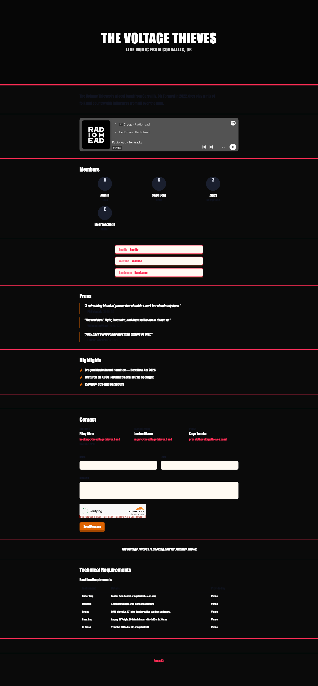
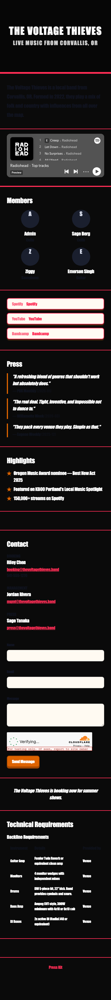

**Route** `/band-site/thevoltagethieves`, served at `{slug}.corvmc.org` · **Guard** flag +
`tier = 'premium'`.

The premium public face, on the act's own subdomain or custom domain, with its own theme and
no CMC chrome. A free act's subdomain 302s to its directory profile instead.

**User stories**

- As a premium band, I want a page that looks like us, not like the collective.
- As a booker, I want the band's own domain to work.

**What the fixtures show** — seeded blocks, a theme, custom CSS, members and events.

**Known friction** _(open)_ — nothing on the microsite links back to the collective, so a
visitor who arrives here has no route to the directory.

---

## 12. Band site EPK page

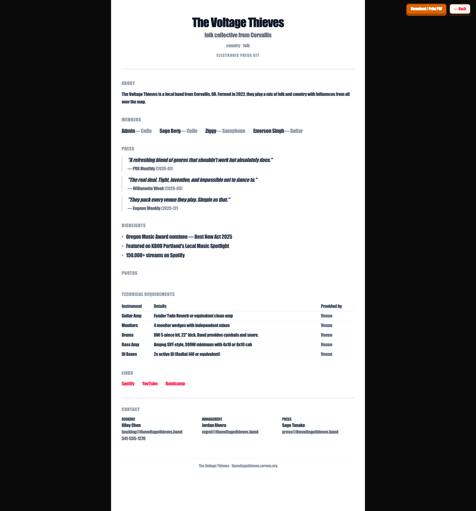
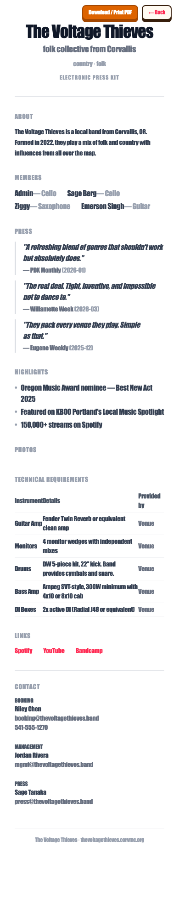

**Route** `/band-site/thevoltagethieves/epk` · **Guard** as above.

The premium themed press-kit page, print-styled. It predates the redesign and is now the
**one duplicated surface in this area**: it renders the same content as the directory
profile's press sections from its own markup.

**User stories**

- As a premium band, I want a press page that matches my site.

**Known friction** _(open — the biggest structural item in this handoff)_ — this page and the
directory profile now say the same thing twice in two sets of components. It is also one of
the three worst offenders in the repo for raw utility classes
(`docs/development/template-audit.md`). A redesign should decide whether it survives at all,
or becomes the directory profile rendered in the act's theme.

---

## Open questions a redesign has to decide

1. **Does the microsite EPK page survive?** It duplicates the directory profile's press
   sections. Merging them is the single largest simplification available here.
2. **How is "public vs package" shown?** Today it is description text under each card. A
   band skimming the editor cannot see at a glance which half of the page a stranger reads.
3. **What does a failed or missing press photo look like?** There is no placeholder state,
   and the free tier's single photo makes its absence conspicuous.
4. **Where does the ladder live long term?** It is on two surfaces with two shapes (compact
   on the dashboard, full in the editor) and no anchors linking a rung to the field it names.
5. **Does the print stylesheet stay the PDF story?** The package ships an HTML one-pager
   today; a real `press-kit.pdf` via Browser Rendering is designed and deferred. If it ships,
   the page's own print view may become redundant.
6. **Is one free photo the right number?** It is one constant (`FREE_PRESS_PHOTOS`), and the
   cap is the most visible thing separating the tiers.

## Regenerating this

Requires the dev server up and the DB seeded. **Stop the dev server before `db:reset`** —
running it while workerd holds the D1 files poisons the stub and every later request 500s.

```bash
pnpm db:reset
```

Then start the dev server (it must bind the port in `ORIGIN`, or better-auth 404s) and:

```bash
pnpm exec tsx scripts/handoff/capture-press-kit.ts
```

`ONLY=press-kit-photos,band-site` reshoots a subset. `BASE_URL` overrides the port. The run
writes `docs/handoff/press-kit/capture-report.json` (gitignored — it is output, not
source) and **fails rather than saving a misleading image**: every screen has a data-bearing readiness condition and a minimum
rendered-text length, and a file under the size floor is rejected.

### Caveats on what these screenshots show

- **Seeded media keys name no real R2 object.** Photo thumbnails therefore do not render. The layout around them is real; the images are not. Screen 6 shows this
  directly.
- **Screens 9–12 need a premium band.** They are gated on `band_site.tier` alone now that
  Band Premium has launched; the dev seed marks three bands premium.
- **`minText` thresholds are ~65% of measured length**, not guesses. Measured at desktop:
  directory 1534, public profile (free) 1221, (premium) 1429, dashboard 511, press-kit editor
  2753, premium editor 2914, profile editor 1065, subscription 780, page editor 2021, band
  site 1421, band-site EPK 1404. The dashboard is genuinely sparse and passes honestly.
- **Full-page capture grows the window rather than using `fullPage` alone.** This shell pins
  the frame to the viewport and scrolls an inner element, so `fullPage` by itself returns
  exactly one screen.
- **Element shots need a `clip` selector, not `scrollIntoView`.** Scrolling before a full-page
  shot changes nothing, and produced a byte-identical duplicate that only an md5 caught.
