# Volunteering: every screen, and what it is for

> A design handoff. Thirty-one volunteer screens, each shot from a populated local seed at
> desktop and mobile, each with the who/what/where/when/how of the person looking at it and
> the user stories it serves.
>
> Companion to [volunteer-workflow-findings.md](volunteer-workflow-findings.md) (what is
> wrong with the shape), [../specs/shipped/volunteering-spec.md](../specs/shipped/volunteering-spec.md)
> (why the model is what it is) and
> [../development/business-workflows.md](../development/business-workflows.md#12-volunteering)
> (how it behaves today).
>
> **Status: current as of the screenshots below.** Regenerate them with
> `pnpm db:reset && pnpm dev` and then `pnpm screens:volunteer`.

## Why this exists

The findings report argued that the coordinator's half of volunteering is shaped like the
database — a table of hour logs, a table of volunteers, a table of shifts, a catalog of
roles, a catalog of certifications, a report — when the job is shaped like a list of
decisions. Most of its blocking findings have since been fixed in code, and
`/staff/volunteer` is now a worklist rather than a table. What has not happened is a pass
over the **shape** of the surfaces themselves.

That pass needs to see them. This document is the seeing: every screen a volunteer or a
coordinator can reach, populated, side by side, with enough context to redraw.

## What volunteering is

CMC runs on volunteer labor and the module gives it a home. Staff define **roles** — job
types with markdown descriptions, like Sound Engineering or Front Desk. Members say which
roles interest them (a standing note, not a commitment to a date), claim dated **shifts**,
and log **hours**. Staff work an approval queue, and a date-ranged report rolls approved
hours up by member, role and month — the number the board and grant applications ask for.

Three rules run through every screen:

- **Approved hours are a record, not a currency.** They never become practice-room credits
  and never touch the finance ledger.
- **Certifications gate scheduling, never the record of work already done.** Whether a member
  held one is evaluated as of the _shift's_ date, not today's.
- **Confirmation is load-bearing.** Only a `confirmed` signup earns the day-before reminder
  and the auto-complete; only a `completed` signup produces the pre-filled hour log and the
  feedback request. A claim nobody confirms silently produces none of it.

## The vocabulary a wireframe must use

All of it lives in `src/lib/config.ts`. Two labels deliberately differ from the stored value,
and getting them wrong on a wireframe changes what the screen means:

| Concept         | Values                                                      | Note                                                                                      |
| --------------- | ----------------------------------------------------------- | ----------------------------------------------------------------------------------------- |
| Signup status   | `claimed`, `confirmed`, `completed`, `cancelled`, `no_show` | Mirrors reservation statuses on purpose                                                   |
| Hour-log status | `pending`, `approved`, `rejected`                           | **`rejected` renders as "Returned"** — it is a request for a correction, not a judgement  |
| Profile status  | `active`, `blocked`                                         | **`blocked` renders as "Needs review"** — today its only cause is an under-18 self-signup |
| Role group      | `at-shows`, `away-from-shows`, `committee`                  | Presentational grouping only                                                              |

Hours are stored as integer minutes and rendered by `formatVolunteerHours` — "3 hrs" for a
whole number, "1.5 hrs" otherwise. Dates worked are anchored at **noon club time**, which is
why nothing in this module has the month-boundary bug.

## The four demo logins

`pnpm db:reset` seeds these, all with the password `password`. Three of the five
member-facing pages are gated on onboarding stage and those states are mutually exclusive
per user, so seeing the member's half takes three accounts.

| Login                            | Who they are                           | What they reach                                           |
| -------------------------------- | -------------------------------------- | --------------------------------------------------------- |
| `coordinator@corvallismusic.org` | Nia Okafor, `staff`                    | Every `/staff/volunteer` page, without the admin-only nav |
| `volunteer@corvallismusic.org`   | Sam Whitfield, active volunteer        | The member dashboard, interests, and the shift survey     |
| `newcomer@corvallismusic.org`    | Ellis Park, no volunteer profile       | `/member/volunteer/start`                                 |
| `minor@corvallismusic.org`       | Robin Vance, under 18, awaiting review | `/member/volunteer/blocked`                               |

## Route map

| URL                                     | File                                                       | Guard                           | Who                 |
| --------------------------------------- | ---------------------------------------------------------- | ------------------------------- | ------------------- |
| `/member/volunteer`                     | `src/routes/member/volunteer/+page.svelte`                 | `requireUser` + stage `active`  | Member              |
| `/member/volunteer/start`               | `.../start/+page.svelte`                                   | `requireUser` + stage `none`    | Member              |
| `/member/volunteer/interests`           | `.../interests/+page.svelte`                               | `requireUser` + stage `active`  | Member              |
| `/member/volunteer/blocked`             | `.../blocked/+page.svelte`                                 | `requireUser` + stage `blocked` | Member              |
| `/member/volunteer/feedback/[signupId]` | `.../feedback/[signupId]/+page.svelte`                     | `requireUser` + ownership       | Member              |
| `/staff/volunteer`                      | `src/routes/staff/volunteer/+page.svelte`                  | `requireStaff`                  | Coordinator         |
| `/staff/volunteer/schedule`             | `.../schedule/+page.svelte`                                | `requireStaff`                  | Coordinator         |
| `/staff/volunteer/hours`                | `.../hours/+page.svelte`                                   | `requireStaff`                  | Coordinator         |
| `/staff/volunteer/people`               | `.../people/+page.svelte`                                  | `requireStaff`                  | Coordinator         |
| `/staff/volunteer/shifts`               | `.../shifts/+page.svelte`                                  | `requireStaff`                  | Coordinator         |
| `/staff/volunteer/shifts/[id]`          | `.../shifts/[id]/+page.svelte`                             | `requireStaff`                  | Coordinator         |
| `/staff/volunteer/roles`                | `.../roles/+page.svelte`                                   | `requireStaff`                  | Coordinator         |
| `/staff/volunteer/roles/[id]`           | `.../roles/[id]/+page.svelte`                              | `requireStaff`                  | Coordinator         |
| `/staff/volunteer/certifications`       | `.../certifications/+page.svelte`                          | `requireStaff`                  | Coordinator         |
| `/staff/volunteer/clearances`           | `.../clearances/+page.svelte`                              | `requireStaff`                  | Coordinator         |
| `/staff/volunteer/report`               | `.../report/+page.svelte`                                  | `requireStaff`                  | Coordinator / board |
| `/staff/users/[id]?tab=volunteer`       | `src/routes/staff/users/[id]/panels/VolunteerPanel.svelte` | `requireStaff`                  | Coordinator         |

`/staff/volunteer/interest` still exists as a 308 to `/staff/volunteer/people`. It has no
page of its own and is not screenshotted.

Remote functions are the security boundary: every one of these pages gets its data from
`src/lib/remote/volunteer.remote.ts`, which guards first and takes its params from a client
header. A guard in a layout guards nothing.

## How to read a screen entry

Each one carries the two screenshots, where it sits, the paragraph that places it, the user
stories it serves, what the seed is showing so you know which states are represented, and
what is already known to be wrong with it. Findings are cited by their id in
[volunteer-workflow-findings.md](volunteer-workflow-findings.md) — **✅ fixed** where the
code has since caught up, **open** where it has not.

---

# Part one — the member

Four accounts' worth of screens, because the member surface is a funnel with three mutually
exclusive gates: a member with no volunteer profile, a member waiting on a guardian, and a
member who is volunteering.

## 1. Volunteer sign-up — `/member/volunteer/start`

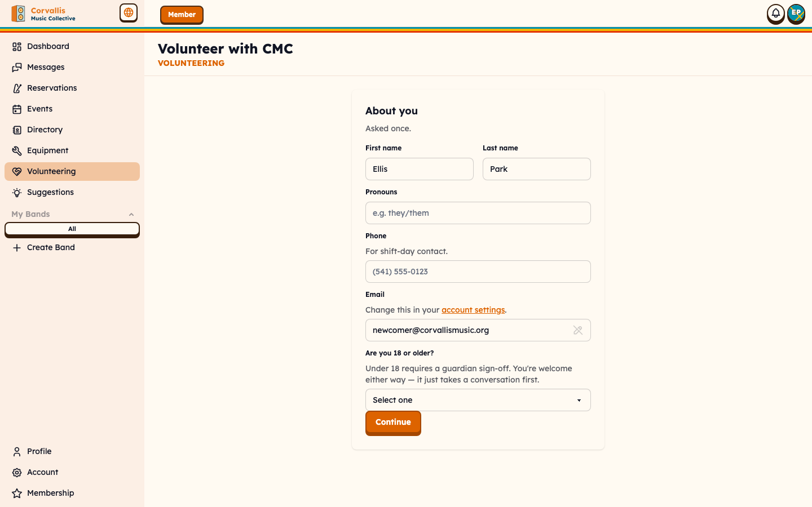
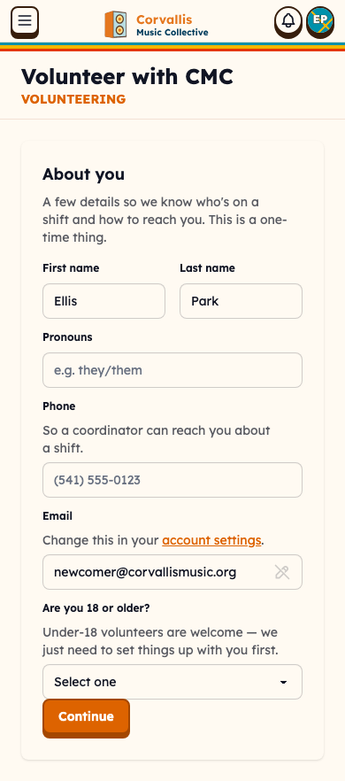

`src/routes/member/volunteer/start/+page.svelte` · `requireUser`, stage `none` ·
`getVolunteerStartStep`, `startVolunteerOnboarding`

**Who/what/where/when/how.** A signed-in member who has never volunteered, the first time
they follow the Volunteering link from the member nav or the `/contribute` call to action.
Everything under `/member/volunteer` redirects here until this form is submitted, so it is
the only door into the module. It asks for the four things a coordinator needs to put
somebody on a shift — first name, last name, pronouns, phone — and one thing the law needs:
are you 18 or older. Email is shown, not editable, with a pointer at account settings. The
member fills it once and never sees it again; answering "no" to the age question is a
one-way door to screen 2, which is why `updateVolunteerProfileSchema` deliberately omits
`isAdult` and no later form can flip it back.

**User stories.**

- As a member who wants to help, I want to say who I am once, so that I am not asked again
  every time I pick up a shift.
- As a coordinator, I want a phone number on file, so that I can reach somebody about
  tonight's shift without waiting on email.
- As CMC, I want the under-18 question asked before anybody can claim a shift, so that a
  minor never ends up on a load-out at midnight without a guardian's sign-off.

**What the seed is showing.** `newcomer@corvallismusic.org` — a member with no
`volunteer_profile` row at all. The form is empty except for the read-only email.

**Known friction.** None specific to this screen. It is the one page in the module that was
designed as a task rather than as a table.

## 2. Almost there — `/member/volunteer/blocked`

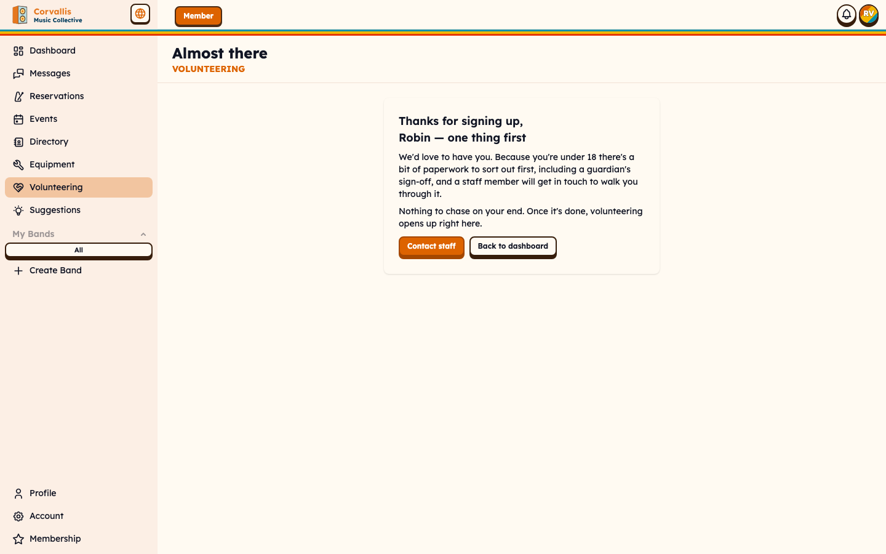
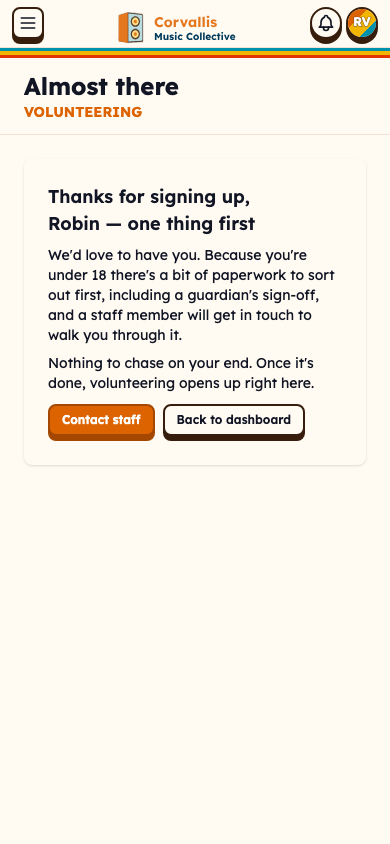

`src/routes/member/volunteer/blocked/+page.svelte` · `requireUser`, stage `blocked` ·
`getVolunteerBlockedNotice`

**Who/what/where/when/how.** A member who answered "no" to the age question on screen 1,
every time they open Volunteering until staff clear them. It is a terminal notice, not a
form: it greets them by the first name they just gave, explains that a guardian's sign-off
is needed, states plainly that nothing else is required of them, and offers two ways out —
`/contact` and back to the dashboard. The unblocking happens on the coordinator's side
(screen 10's under-18 card), and when it does this page stops appearing on its own.

**User stories.**

- As an under-18 member, I want to know that I have not been rejected, so that I do not
  assume CMC does not want me.
- As an under-18 member, I want to know whether the ball is in my court, so that I am not
  waiting on a form I cannot find.
- As CMC, I want the pause to read as paperwork rather than as a refusal, so that a
  fourteen-year-old who wants to run cables stays interested.

**What the seed is showing.** `minor@corvallismusic.org` — Robin Vance, `isAdult: false`,
`status: 'blocked'`, signed up a couple of days ago. Their row is simultaneously visible in
the coordinator's under-18 queue on screen 10.

**Known friction.** The state is called `blocked` in the database and "Needs review" in
every staff-facing label. A wireframe should keep the member-facing language as far from
"blocked" as this page already does.

## 3. What would you like to help with? — `/member/volunteer/interests`

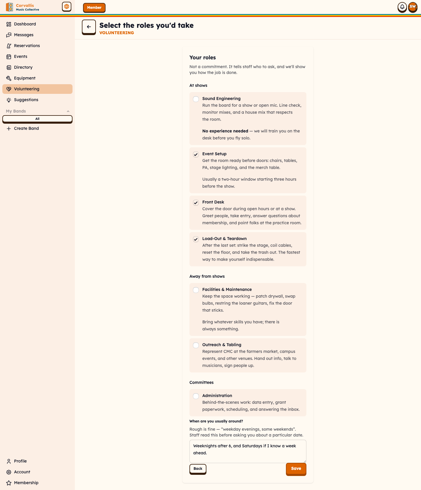
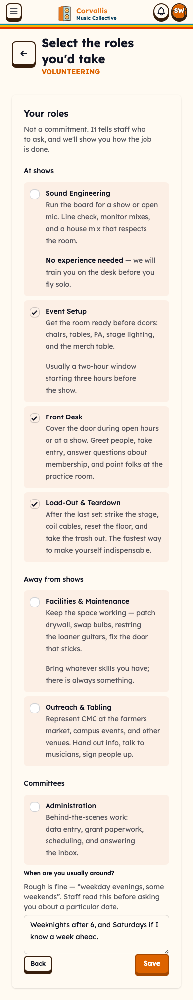

`src/routes/member/volunteer/interests/+page.svelte` · `requireUser`, stage `active` ·
`getVolunteerInterestsPage`, `saveVolunteerInterests`

**Who/what/where/when/how.** The second step of onboarding, and afterwards a page the member
can come back to whenever what they want to do changes. It lists every live role grouped by
`at-shows` / `away-from-shows` / `committee`, each with the markdown job description staff
wrote — which is the substance of the page, and the reason roles are a table rather than an
enum. Below the roles is one free-text availability field. Ticking a box is explicitly _not_
a commitment to a date; it is a standing note that puts the member on the "who can I ask"
list for that role. The step is skippable, and the same field set appears as a modal on the
dashboard (screen 7) so it never has to be a detour.

**User stories.**

- As a new volunteer, I want to read what each job actually involves before I say yes, so
  that I am not agreeing to run a mixing desk I have never seen.
- As a volunteer with a job, I want to say when I am free in my own words, so that nobody
  offers me a Tuesday morning.
- As a coordinator, I want a standing list of who is up for what, so that filling a short
  shift starts with a shortlist instead of a mailout.

**What the seed is showing.** Seven live roles across three groups, with their real markdown
descriptions; Zine & Print is archived and correctly absent. Sam Whitfield has Front Desk,
Event Setup and Load-Out & Teardown ticked, and availability text on file.

**Known friction.** A6 (**✅ fixed**) — availability is now rendered on
`/staff/volunteer/people` and on the role page's interested-members list. It was collected
here and shown to nobody for the module's first year, which is worth remembering as the
failure mode this page invites: it is easy to collect a field here that no staff surface
ever reads.

## 4. Volunteering — `/member/volunteer`

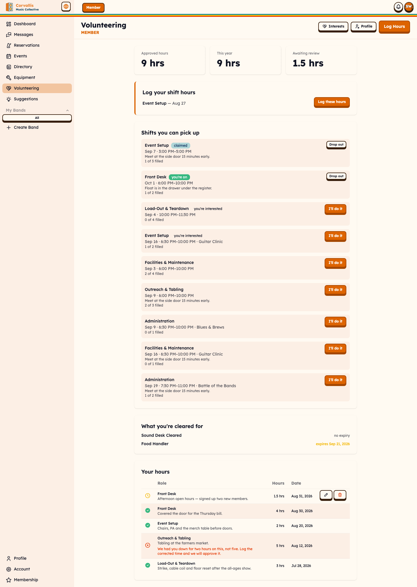
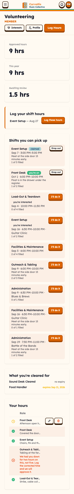

`src/routes/member/volunteer/+page.svelte` · `requireUser`, stage `active` ·
`getMemberVolunteerPage` (which composes `getMyVolunteerAccess`, `getActiveVolunteerRoles`,
`getMyVolunteerInterests`, `getOpenShifts`, `getUnloggedShifts`, `getMyVolunteerHours`,
`getMyVolunteerSummary`, `getMyCertifications`)

**Who/what/where/when/how.** The active volunteer's home for the whole module, reached from
the member nav, and the busiest page in the feature — five distinct jobs stacked in one
column. Top: three stat cards (approved hours, this year, awaiting review) with the
Interests / Profile / Log Hours actions in the header. Then **Log your shift hours**, which
only appears when a completed shift has no hour log against it, and pre-fills the log from
the shift. Then **Shifts you can pick up**, the board: every upcoming shift with a status
chip (`claimed`, `you're on`, `you're interested`), a filled count, the shift notes, and one
button that is either "I'll do it" or "Drop out". Then **What you're cleared for**, the
member's certifications with expiry. Then **Your hours**, their own log with edit and
withdraw per row. Someone opens this before a show to see what they are on, and after one to
file the time.

**User stories.**

- As a volunteer, I want to see what I am signed up for without opening my email, so that I
  know whether I am working Saturday.
- As a volunteer, I want a shift I just worked to offer to log itself, so that filing hours
  is one click rather than a form I have to remember to fill.
- As a volunteer, I want the shifts I said I was interested in to stand out from the rest,
  so that the board reads as a shortlist rather than a wall.
- As a volunteer, I want to see when my food handler card expires, so that I renew it before
  it costs me a shift.
- As a volunteer, I want to correct a log I got wrong, so that a typo does not need a staff
  conversation.

**What the seed is showing.** Sam Whitfield: 9 approved hours, 1.5 awaiting review; one
unlogged Event Setup shift from Aug 27; nine upcoming shifts, of which one is claimed, one
is confirmed ("you're on"), two are interest-matched, and the rest are open; two
certifications, one of them expiring inside the warning window; five hour logs covering
approved, pending and returned.

**Known friction.** D4 (**✅ fixed**) — `getMyCertifications` had no caller at all when the
findings were written, so a member could not see what they were cleared for. The "What
you're cleared for" block is that fix. The page's own shape is the open question: five
sections in one column, and on mobile the board alone is most of the scroll.

## 5. How did it go? — `/member/volunteer/feedback/[signupId]`

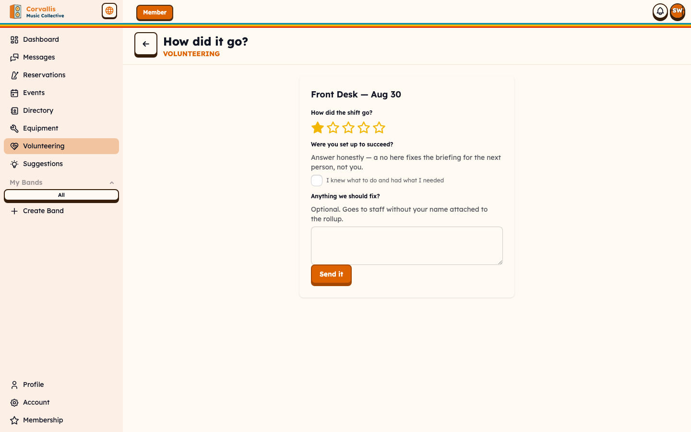
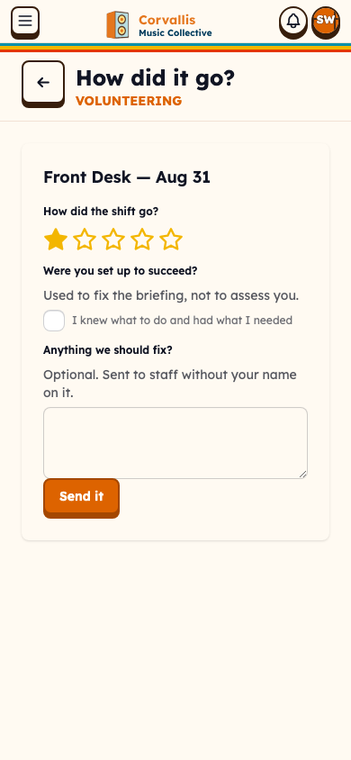

`src/routes/member/volunteer/feedback/[signupId]/+page.svelte` · `requireUser` + ownership
checked server-side · `getShiftFeedbackContext`, `submitShiftFeedback`

**Who/what/where/when/how.** A volunteer the day after a shift they completed, arriving from
the email the `shift-feedback` cron sends — this page is not linked from anywhere in the
app. It asks two deliberately different questions: a 1–5 rating of how the shift went, and a
yes/no on "were you set up to succeed", which is the one CMC can act on. The comment box is
optional and says out loud that it reaches staff without a name attached to the per-role
rollup. Submitting once closes it; the page handles the already-answered and
not-your-shift cases in place rather than 404ing.

**User stories.**

- As a volunteer, I want to say the room was not ready without it being a complaint about a
  person, so that I actually say it.
- As a volunteer, I want answering to take ten seconds on a phone, so that I answer at all.
- As a coordinator, I want to know which roles are sending people in under-briefed, so that
  I fix the briefing rather than the volunteer.

**What the seed is showing.** `seed-vol-signup-feedback` — Sam Whitfield's completed Front
Desk shift from two days ago, hours already filed, feedback not yet given. Its mirror image
(`seed-vol-shift-unlogged`) has feedback but no hours, so both halves of the day-after loop
have a row.

**Known friction.** Nothing found. E lists the feedback loop among the parts checked and
found sound. Note for the wireframe: this is the only member screen that arrives from an
email, so it has no nav context and cannot assume any.

## 6–9. The member's four modals

Every modal in this module is a `bits-ui` dialog opened by `src/lib/components/ui/Action.svelte`,
so they share a frame: a title, the fields, a Dismiss and a submit whose label names the
action. They are worth wireframing separately because on a phone a modal _is_ the screen.

### 6. Log volunteer hours

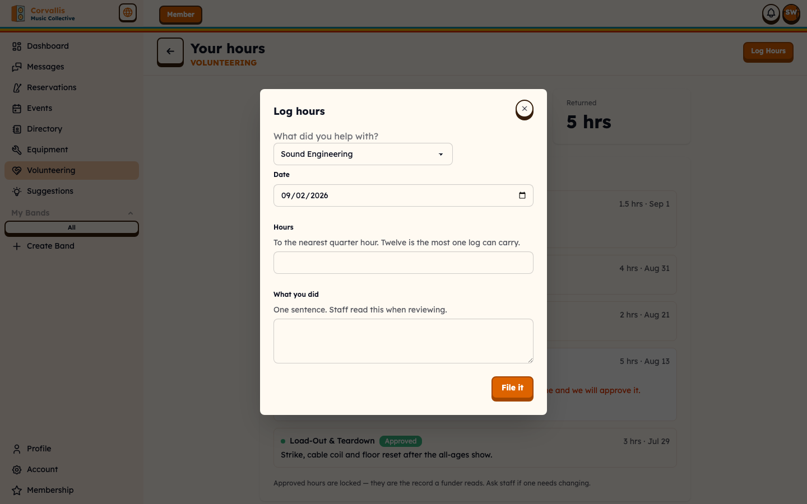
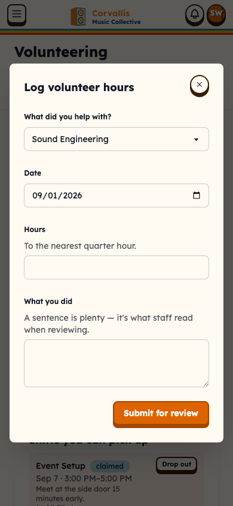

Opened from **Log Hours** in the dashboard header · `submitVolunteerHours`

**Who/what/where/when/how.** A volunteer filing work that had no shift behind it — a work
party, a committee meeting, an afternoon fixing the door. Role, date, hours and a
description of what they did. The date is bounded: `VOLUNTEER_BACKDATE_LIMIT_DAYS` is 90,
and the error a member gets past that tells them to ask staff, which is a promise screen 13
now keeps. Hours step in quarters and cap at 12 per log. The row lands `pending` and shows
up in the coordinator's queue the same moment.

**User stories.** As a volunteer, I want to log the two hours I spent restringing loaners,
so that work away from shows counts the same as work at one. As CMC, I want a description on
every log, so that the reviewer is approving something they can recognise.

### 7. What you can help with

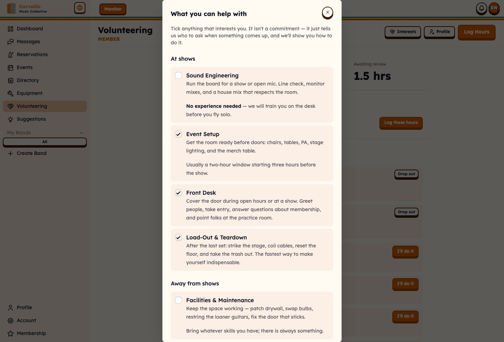
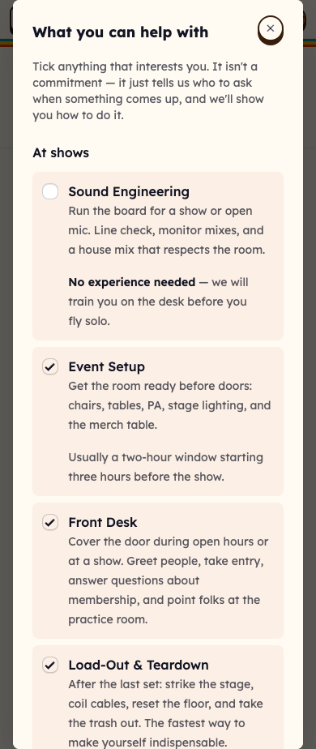

Opened from **Interests** in the dashboard header · `saveVolunteerInterests`

The same field set as screen 3, in a dialog, so that changing your mind is not a page
navigation away from the board you were reading. On desktop it is a comfortable list; on
mobile it is seven roles with full markdown descriptions inside a scrolling modal, which is
the single most cramped surface in the module and the clearest candidate for a redraw.

**User stories.** As a volunteer whose Tuesdays just freed up, I want to add a role without
losing my place, so that the board I was looking at is still there afterwards.

### 8. Log hours for {role}

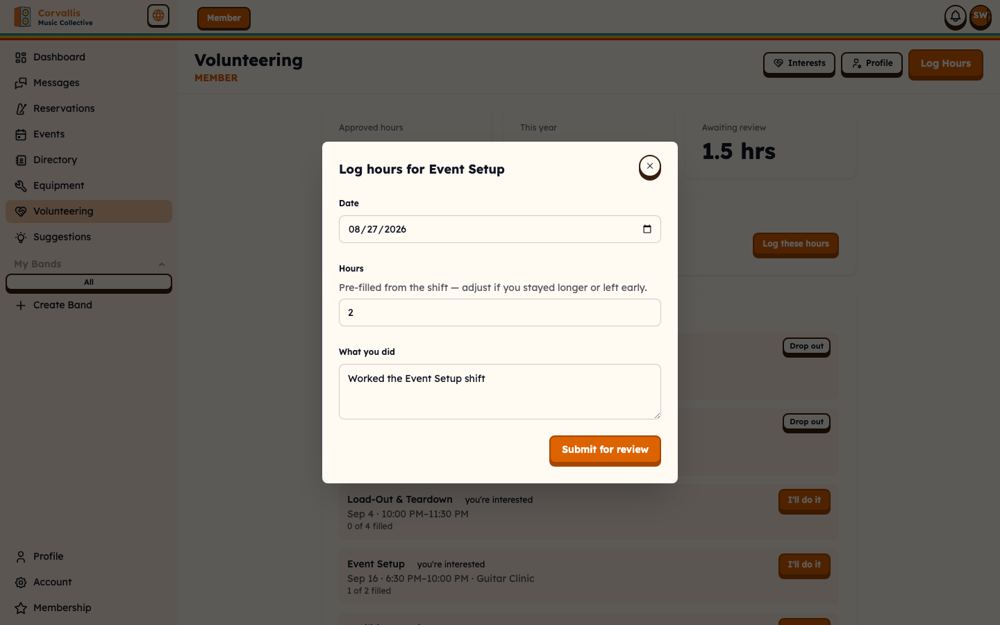
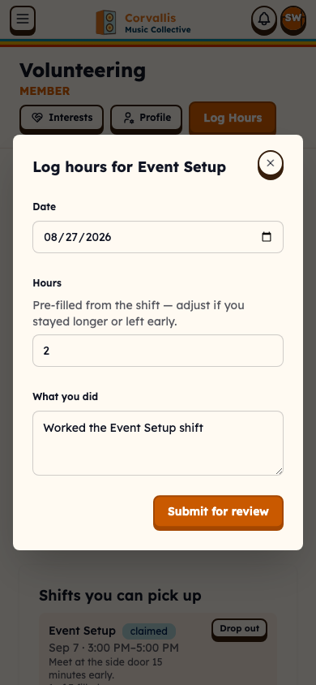

Opened from **Log these hours** on an unlogged completed shift · `submitVolunteerHours`

The same form as screen 6 with role, date and duration already filled in from the shift, so
the only thing left is what they actually did. This is the payoff for confirming a signup:
an unconfirmed claim never completes, so it never produces this offer. The seed keeps half
the completed signups unlogged precisely so this card always has a row.

**User stories.** As a volunteer, I want the shift I just worked to know its own date and
length, so that filing it is one sentence.

### 9. Claim this shift?

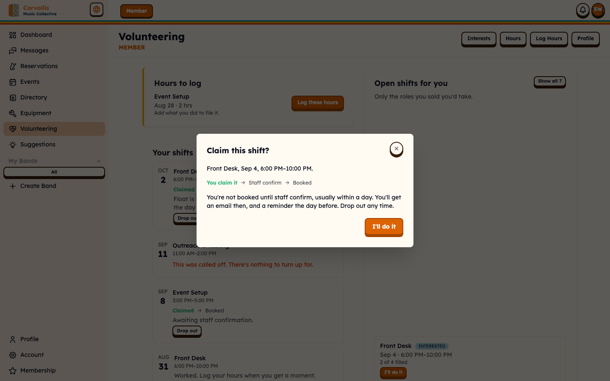
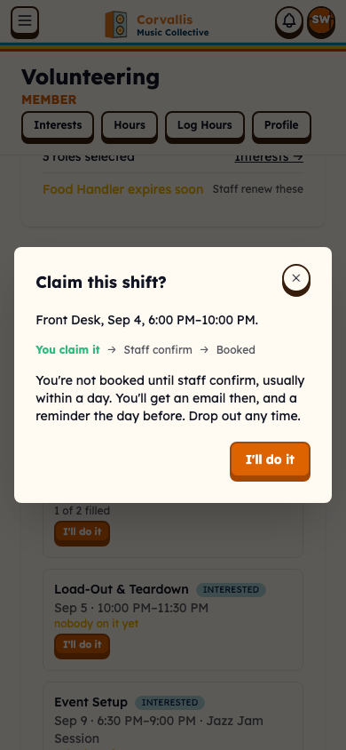

Opened from **I'll do it** on any open shift · `claimShift` (`src/lib/components/volunteer/OpenShifts.svelte`)

A confirmation, not a form: it restates the role, date, time and notes, and asks. The service
behind it writes `INSERT … SELECT … WHERE hasRoom`, so two people claiming the last place at
once is settled by the database and the loser is told the shift is full rather than silently
overbooking. The claim lands `claimed`, **not** `confirmed` — which is the hinge the whole
coordinator side turns on, and the member is given no indication here that a second step
exists.

**User stories.** As a volunteer, I want to re-read the notes before I commit, so that
"meet at the side door" is not news on the night. As a volunteer, I want to know whether I
am actually booked, so that I am not guessing.

**Known friction.** A3 (partly open) — claims now emit `volunteer.signup_claimed` and every
staff list splits confirmed from claimed, so the coordinator is told. The member is still not
told that "claimed" is not yet "booked", and this dialog is where that could be said.

---

# Part two — the coordinator

Twelve screens plus the volunteer tab on a member's staff record. Everything here is
`requireStaff`, and the screenshots are taken as `coordinator@corvallismusic.org` — a `staff`
account with no `admin` role, so what you see is the nav a volunteer coordinator actually
gets.

## 10. Volunteering — `/staff/volunteer`

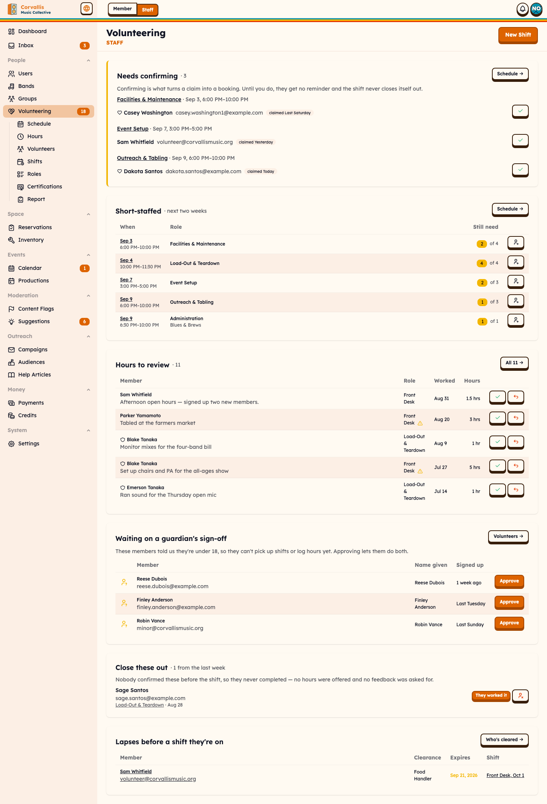
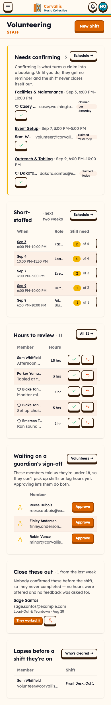

`src/routes/staff/volunteer/+page.svelte` · `requireStaff` · `getVolunteerWorklist`

**Who/what/where/when/how.** The volunteer coordinator, first thing, from the sidebar — whose
badge counts the same `countVolunteerWorkWaiting` these cards are built from, so the number
on the nav and the rows on the page cannot disagree. This is the module's answer to "what
needs me today", and it replaced the hour-log table that used to live at this URL. Six cards,
each hidden entirely when it is empty, each with its action on the row rather than behind a
detail page:

1. **Needs confirming** — claims nobody has turned into bookings, grouped by shift, with a
   confirm-all per shift and a confirm per person. The card says out loud why it matters.
2. **Short-staffed** — shifts in the next two weeks with places still open, and an
   add-a-person button per row.
3. **Hours to review** — the top of the pending queue, approve or return in place.
4. **Waiting on a guardian's sign-off** — the under-18 approvals, which is the only thing
   that unblocks screen 2.
5. **Close these out** — shifts that finished with an unconfirmed claim, so they never
   auto-completed and never offered hours or feedback. "They worked it" or "No-show".
6. **Lapses before a shift they're on** — a clearance whose expiry falls before a shift the
   holder is already rostered on. Not "who expires soon": the join to the schedule is the
   whole point.

**User stories.**

- As a coordinator, I want one page that tells me what is waiting, so that I am not opening
  six tables to find out.
- As a coordinator, I want to confirm six claims without leaving the page, so that clearing
  them is not four page loads and six modals.
- As a coordinator, I want to be told that Saturday is short while there is still time to
  ask somebody, so that I find out before the night rather than after.
- As a coordinator, I want to know that Sam's food handler card runs out before the shift he
  is already on, so that I am not discovering it at the door.

**What the seed is showing.** Three claims to confirm across three shifts; five short-staffed
shifts; eleven pending hour logs; three under-18 approvals (all plain members — the seed
deliberately keeps them off the admin accounts); one shift to close out; and one lapsing
clearance — Sam Whitfield's Food Handler, expiring Sep 21, against a Front Desk shift on
Oct 1.

**Known friction.** This card set is the fix for D1, A3 and C1, and it is the one staff
surface in the module already shaped like the job. The open question for a wireframe is
everything _below_ it: five more entity pages hang off the same nav, and this page does not
lead into them except by two "→" links.

## 11. Schedule — `/staff/volunteer/schedule`

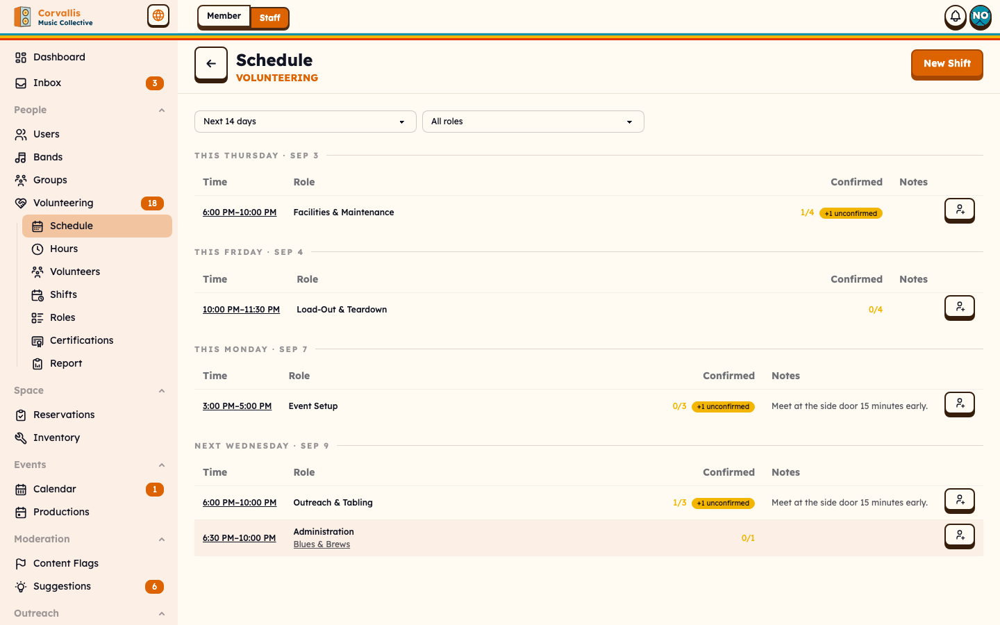
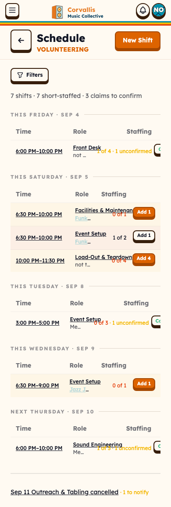

`src/routes/staff/volunteer/schedule/+page.svelte` · `requireStaff` · `getShiftsInWindow`,
`assignShiftToMember`, `getInterestedVolunteers`, `createShift`

**Who/what/where/when/how.** The coordinator planning the week, or checking who is due in
tonight. A 7 / 14 / 30-day window and a role filter, with shifts grouped under a day heading
written in human terms ("THIS THURSDAY · SEP 3"), and three numbers per row rather than one:
confirmed, capacity, and unconfirmed claims called out separately. That split exists because
one conflated number made a shift with three unconfirmed claims read as fully staffed. Each
row carries an add-somebody action that opens on the members who said they were interested in
that role.

**User stories.**

- As a coordinator, I want the next two weeks laid out by day, so that "who is on tonight" is
  a glance rather than a hunt through a flat list.
- As a coordinator, I want a shift with claims nobody confirmed to look different from a
  staffed one, so that I do not walk into Saturday believing it is covered.
- As a coordinator, I want to put a name on a shift from here, so that "put me down for
  Saturday" said at the front desk can be acted on.

**What the seed is showing.** Five days of shifts inside the 30-day window, with mixed states:
`1/4 +1 unconfirmed`, `0/4` wholly open, `0/3 +1 unconfirmed`.

**Known friction.** A4 (**✅ fixed** — this page is the fix; `/shifts` was one flat unbounded
list). A1 (**✅ fixed** — `assignShiftToMember` lands the signup `confirmed`, because a
coordinator typing the name in _is_ the decision). A7 (**open**) — the interested-members list
this page's add action opens still computes readiness against today rather than against the
shift's date, which matters now that adding is possible from the same row.

## 12. Hours to review — `/staff/volunteer/hours`

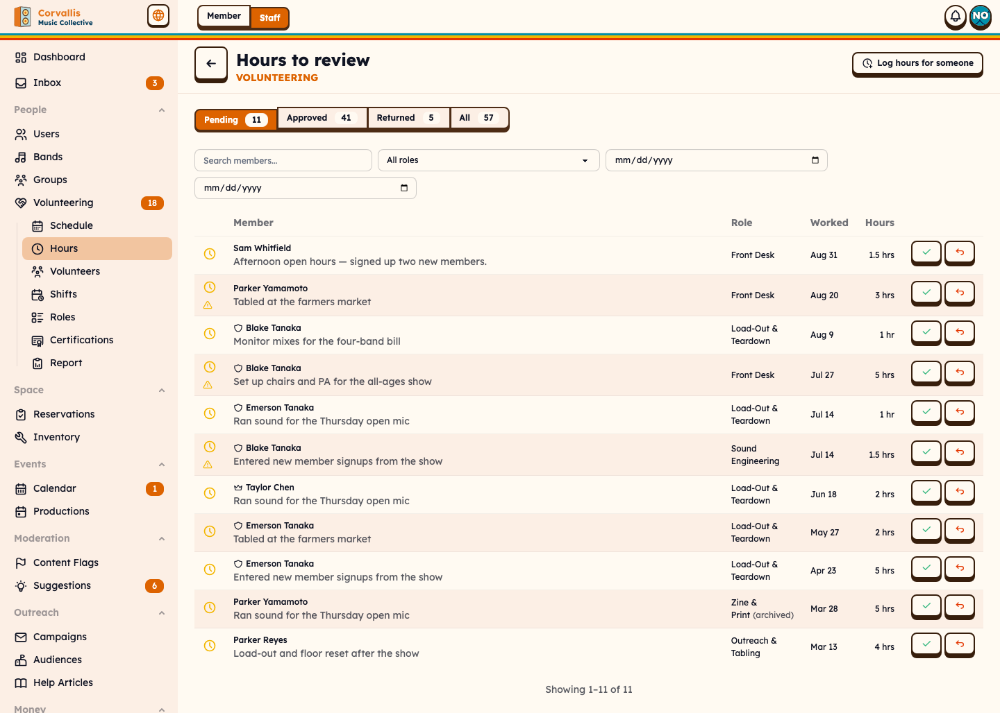
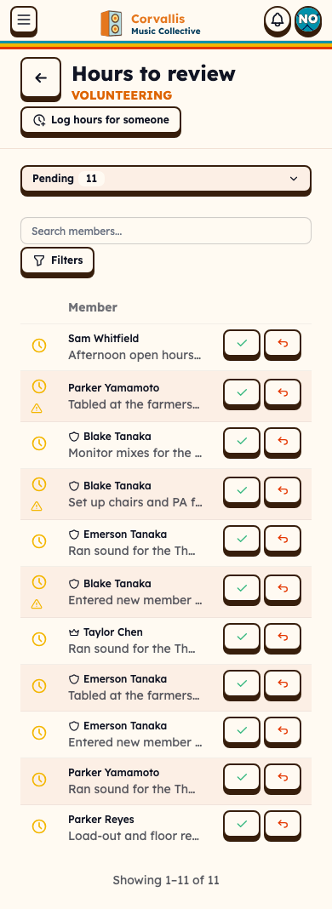

`src/routes/staff/volunteer/hours/+page.svelte` · `requireStaff` · `getStaffVolunteerLogs`,
`getVolunteerStatusCounts`, `approveVolunteerHours`, `rejectVolunteerHours`,
`logHoursForMember`

**Who/what/where/when/how.** The coordinator working the approval queue, weekly or before a
report is due. Status tabs carrying live counts (Pending / Approved / Returned / All), a role
filter, a date range, a search, and pagination — all mirrored into the URL so a filtered queue
can be linked. Each row is the member, their own description as the subline, the role, the
date worked and the hours, with approve and return in the row. Return demands a reason.
Approval is the step that makes a number reportable: every figure on screen 20 filters to
`status = 'approved'`.

**User stories.**

- As a coordinator, I want to clear the queue without opening a row, so that reviewing thirty
  logs is thirty clicks and not thirty pages.
- As a coordinator, I want to tell somebody _why_ I sent their log back, so that they can
  correct it instead of guessing.
- As a coordinator, I want to be warned when somebody logged hours for a role they were not
  cleared for on the day, so that the record is defensible.
- As a coordinator, I want to enter hours for the volunteer who does not use the app, so that
  the report is the whole story and not just the online part of it.

**What the seed is showing.** 11 pending / 41 approved / 5 returned. The pending list mixes
plain logs with logs filed against the archived Zine & Print role, which proves retired roles
still resolve.

**Known friction.** B1 (**✅ fixed**) — `logHoursForMember` exists, lifts the 90-day window and
lands the log `approved` and stamped with the staffer, which is what makes "ask staff to add
anything older" a true sentence. B2 records this page as the one staff surface already shaped
like a task; the findings call it the model for the rest, and a wireframe pass should treat it
as the reference rather than a redraw target.

## 13. Volunteers — `/staff/volunteer/people`

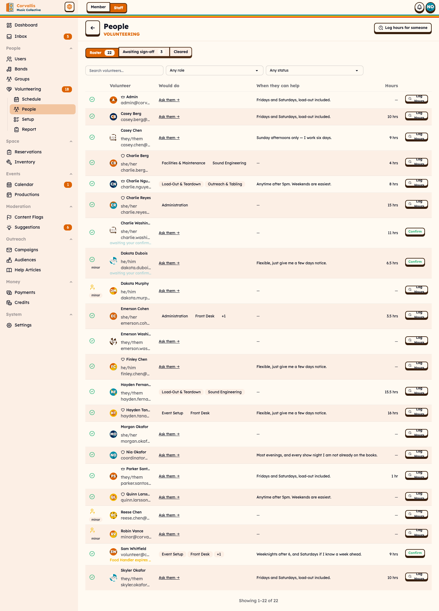
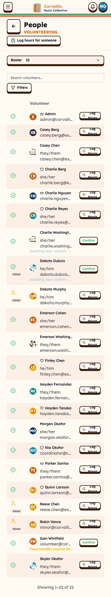

`src/routes/staff/volunteer/people/+page.svelte` · `requireStaff` · `getStaffVolunteers`,
`getVolunteerRoles`

**Who/what/where/when/how.** The roster: every member with a volunteer profile, filterable by
role and by status, which is how the under-18 queue is reached from the nav at all. Columns
are status, volunteer (name, pronouns, email), what they are interested in, when they can
help, hours, and since. It answers "who have we got" and, with the role filter, "who could do
this" — though the shift-shaped version of that question is answered on screen 18 instead.

**User stories.**

- As a coordinator, I want to search the roster by role, so that filling a Front Desk shift
  starts from the people who said they would do Front Desk.
- As a coordinator, I want availability and a phone number in the row, so that "can you do
  Saturday" is answerable without opening anything.
- As a coordinator, I want to see who is waiting on a guardian, so that the under-18 queue is
  reachable when I am not already reviewing hours.

**What the seed is showing.** 19 profiles including three marked `minor`, a spread of
availability text and phone numbers, and hours totals from the review queue.

**Known friction.** A6 (**✅ fixed**) — availability and phone are now in the row; they used
to be collected and shown nowhere. What remains visible on this screenshot is the _other_
half of A6: thirteen of nineteen rows still read `—` under "Interested in", because interest
is opt-in and most members never opened screen 3. The column is honest and nearly empty,
which is a design problem rather than a bug.

## 14. Every shift — `/staff/volunteer/shifts`

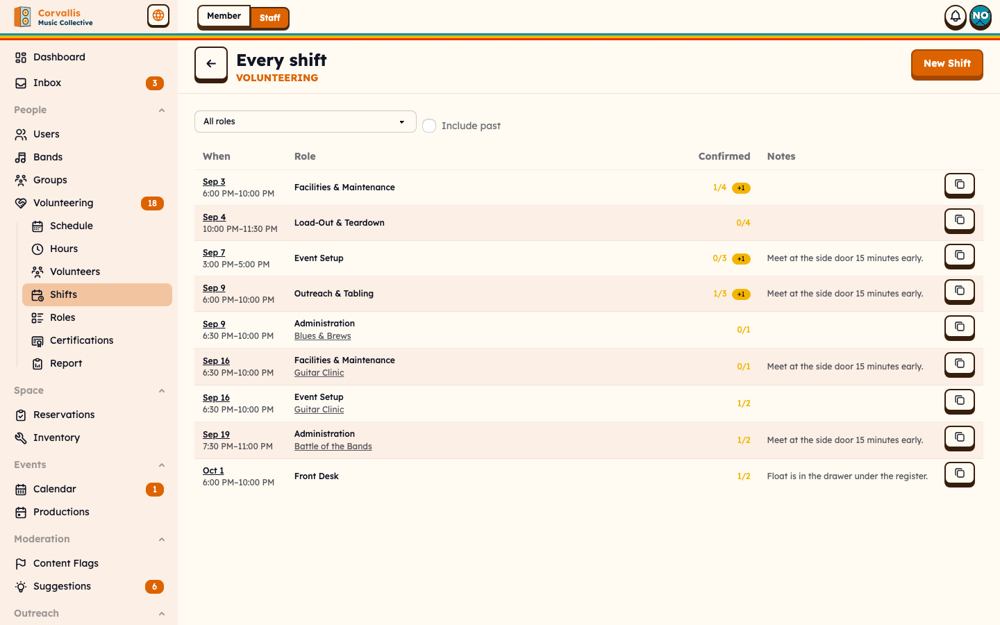
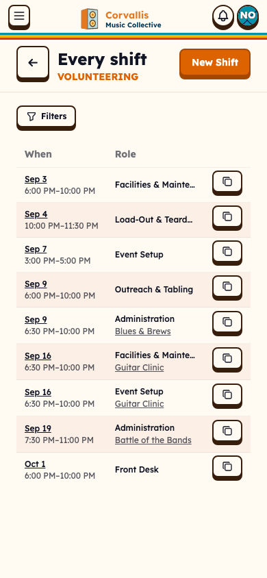

`src/routes/staff/volunteer/shifts/+page.svelte` · `requireStaff` · `getShifts`,
`duplicateShift`, `createShift`

**Who/what/where/when/how.** The full catalog, in date order, with a role filter and an
**Include past** toggle. Where screen 11 answers "what is happening this week", this answers
"does that shift exist" and "what did we run last month". Confirmed-vs-capacity is split here
too (`1/4 +1`), and cancelled shifts stay in the list rather than disappearing, because the
people who signed up still need telling. Each row carries a duplicate action, which copies one
shift forward by a number of days.

**User stories.**

- As a coordinator, I want to find a shift I scheduled last month, so that I can see who
  worked it.
- As a coordinator, I want to copy a standing weekly slot forward, so that setting up eight
  weeks of Front Desk is not eight forms.
- As a coordinator, I want a shift I called off to stay visible, so that I remember it
  happened.

**What the seed is showing.** Nine upcoming shifts, four of them event-attached (the event
name renders under the role), a mix of confirmed and unconfirmed, and the cancelled Outreach
& Tabling shift on Sep 10.

**Known friction.** A8 (**open**) — `duplicateShift` copies exactly one shift by one offset,
so an eight-week block is eight modals over a service call that would take a loop.
Recurrence was declined on purpose; the gap is the bulk case, not the model.

## 15. Shift detail — `/staff/volunteer/shifts/[id]`

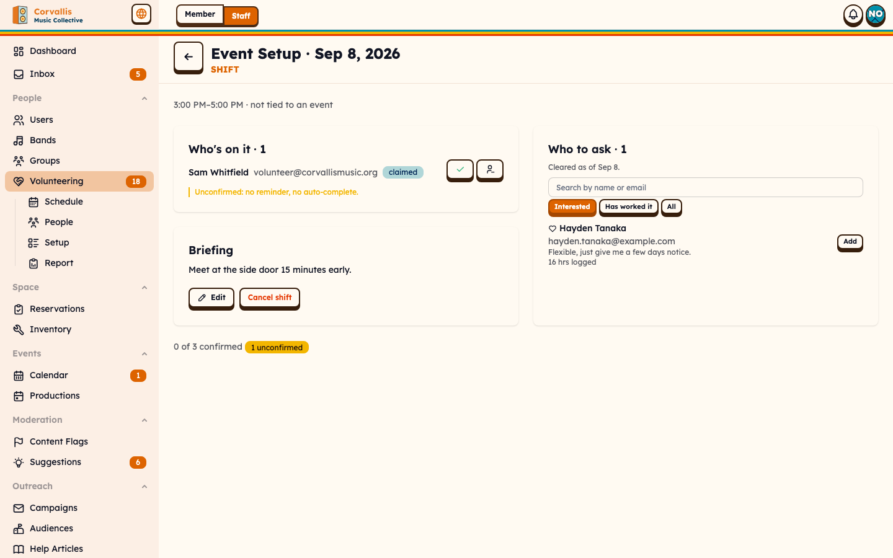
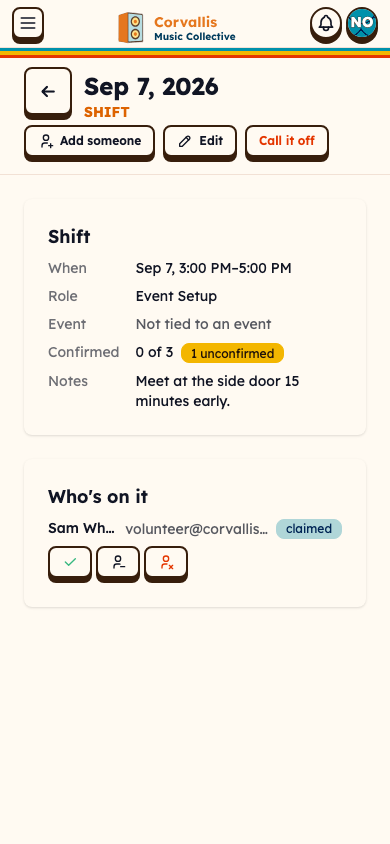

`src/routes/staff/volunteer/shifts/[id]/+page.svelte` · `requireStaff` · `getStaffShiftPage`
(wrapping `getShift` and `getShiftFeedback`), `confirmSignup`, `confirmSignups`,
`releaseSignup`, `markSignupNoShow`, `cancelShift`, `updateShift`, `assignShiftToMember`

**Who/what/where/when/how.** One shift, and everybody on it. Facts at the top — when, role,
the event it staffs or "Not tied to an event", confirmed-of-capacity with unconfirmed called
out, and the notes the claimant sees. Below that, **Who's on it**: a row per person with
their status and, depending on it, confirm / take off the shift / mark no-show. Header actions
are add someone, edit, and call it off. After the night, the feedback left on this shift
appears here. This is where a coordinator runs the shift itself, and where the day-after
reckoning happens.

**User stories.**

- As a coordinator, I want to confirm everybody waiting in one action, so that a four-person
  load-out is not four dialogs.
- As a coordinator, I want to take somebody off a shift they cannot make, so that giving
  notice is not recorded as a no-show against them.
- As a coordinator, I want to mark an actual no-show, so that the pattern is visible if it
  becomes one.
- As a coordinator, I want to call a shift off without deleting it, so that the people on it
  can still be told.

**What the seed is showing.** `seed-vol-shift-claimed` — Event Setup, Sep 7, capacity 3,
"0 of 3 · 1 unconfirmed", Sam Whitfield sitting at `claimed`. Every action on the page has a
target.

**Known friction.** A1 and A2 (**✅ both fixed**) — a coordinator could previously neither put
anybody on a shift nor take them off, the second only expressible as a no-show that did not
happen. A staff release is now a cancellation. A5 (**open**) — the page shows who claimed the
shift and nothing about who _could_; the interested-members list still lives on the role page,
one level away from the question.

## 16. Shift detail, cancelled — `/staff/volunteer/shifts/seed-vol-shift-cancelled`

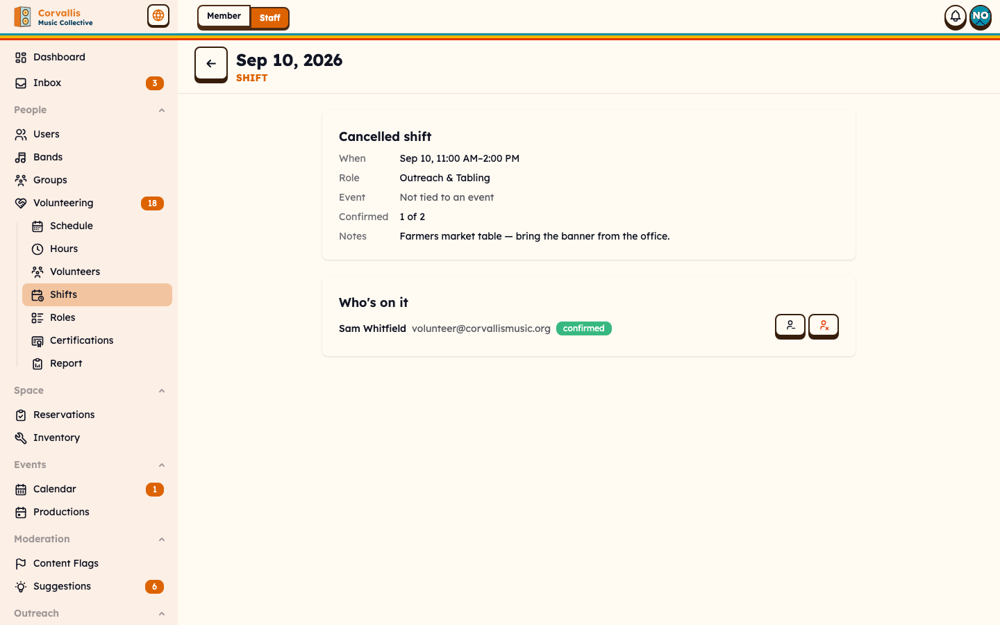
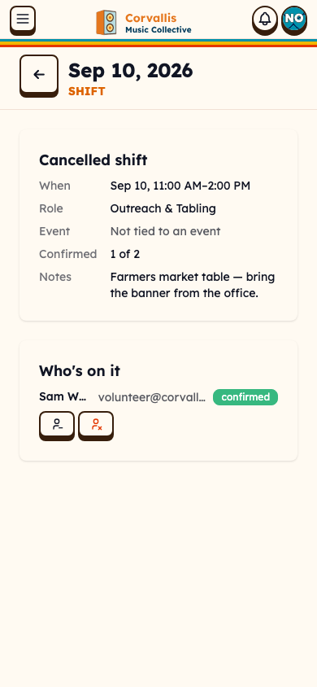

Same file and guards as screen 15.

**Who/what/where/when/how.** The same page after **Call it off**, included separately because
it is a distinct state a wireframe has to account for and one that nothing in the seed used to
produce. `cancelShift` sets `cancelledAt` and deliberately leaves the signups alone: the
people who were confirmed are still confirmed, because they are still the people who need
telling. So the page reads "Cancelled shift" over a roster that still has somebody on it —
which is correct, and looks wrong at a glance.

**User stories.** As a coordinator, I want a called-off shift to still show me who was on it,
so that I know exactly who to message.

**What the seed is showing.** Outreach & Tabling, Sep 10, cancelled two days ago, with Sam
Whitfield still `confirmed` on it.

**Known friction.** The tension above is unresolved by design and is a genuine question for a
wireframe: how does a cancelled shift show that its roster is a to-tell list rather than a
work list?

## 17. Volunteer Roles — `/staff/volunteer/roles`

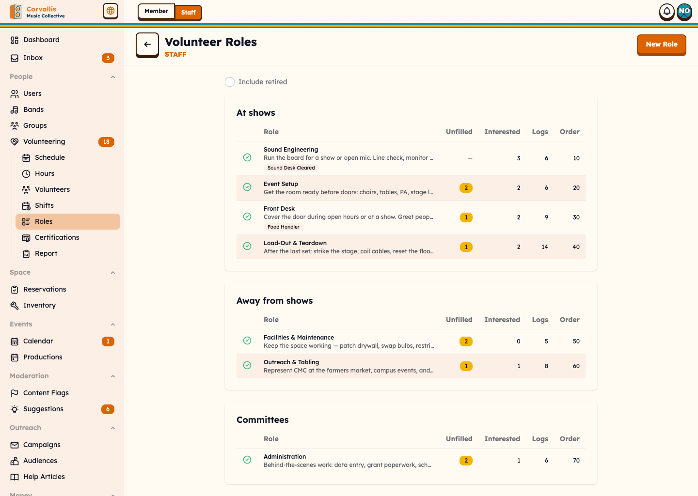
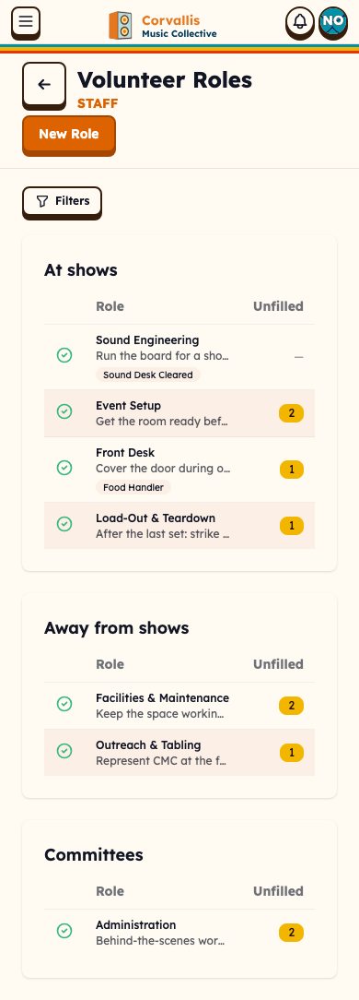

`src/routes/staff/volunteer/roles/+page.svelte` · `requireStaff` · `getVolunteerRoles`,
`createVolunteerRole`

**Who/what/where/when/how.** The job catalog, grouped by the three role groups, with an
**Include retired** toggle. Per role: status, name, the markdown description members read,
any required certifications, unfilled places, interested members, log count, and display
order. Staff open this when the work changes — a new committee, a role nobody does any more.
A volunteer role grants nothing; it is a name, a description and an ordering, and it is a
table rather than an enum specifically so adding "Merch table" does not need a migration.

**User stories.**

- As staff, I want to add a role without a deploy, so that the catalog matches what we
  actually ask people to do.
- As staff, I want to retire a role without deleting it, so that last year's report still
  resolves the hours logged against it.
- As staff, I want to see how many places each role has unfilled, so that I know which job
  descriptions need rewriting.

**What the seed is showing.** Eight roles across three groups, one (Zine & Print) archived and
hidden until the toggle. Sound Engineering shows its Sound Desk Cleared requirement; Front
Desk shows Food Handler.

**Known friction.** The description cell renders the **raw markdown** — `**No experience
needed**` appears with its asterisks in the Sound Engineering row. Members see it rendered on
screen 3; staff see the source. Cosmetic, but visible in the screenshot and worth fixing in
whatever this becomes.

## 18. Role detail — `/staff/volunteer/roles/[id]`

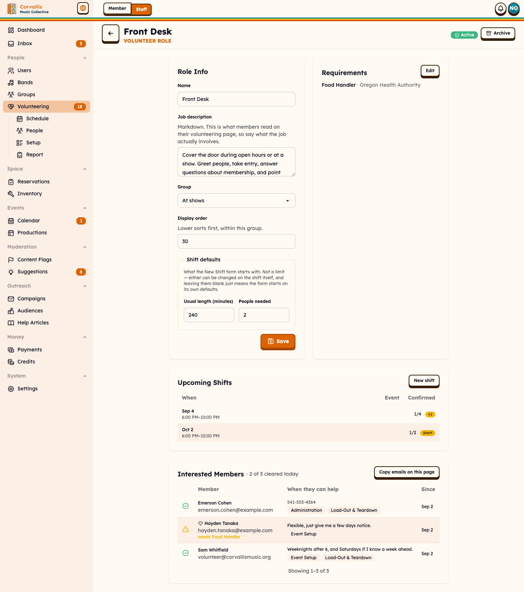
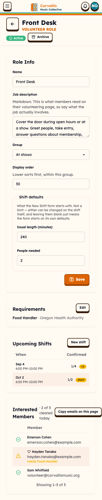

`src/routes/staff/volunteer/roles/[id]/+page.svelte` · `requireStaff` ·
`getStaffVolunteerRolePage` (wrapping `getVolunteerRoleDetail`, `getRoleRequirements`,
`getFeedbackByRole`), `updateVolunteerRole`, `archiveVolunteerRole`, `setRoleCertifications`,
`getInterestedVolunteers`, `createShift`

**Who/what/where/when/how.** One role, and four things hanging off it: an inline edit form
(name, markdown description, group, display order, and the shift defaults the New Shift form
starts from); **Requirements**, the certifications this role demands; **Upcoming Shifts** with
a new-shift action that lands pre-set to this role; and **Interested Members**, which is the
answer to "who can I ask" — with availability, phone, their other roles, a per-member cleared
flag and an _N of M cleared_ count, plus copy-emails. Archive / restore / delete live in the
header, and delete is offered only when nothing was ever logged against the role.

**User stories.**

- As a coordinator, I want to know who is interested in this role and whether they are
  cleared, so that asking is a shortlist and not a mailout.
- As staff, I want to require a certification for a role, so that nobody can claim a shift
  they are not cleared for.
- As staff, I want to set what a shift of this role usually looks like, so that scheduling one
  starts from the right numbers.

**What the seed is showing.** Front Desk: Food Handler required, one upcoming shift reading
`1/2 short`, and two interested members — Sam Whitfield cleared, Parker Yamamoto marked
"needs Food Handler". The "1 of 2 cleared **today**" wording is on screen.

**Known friction.** A5 (**open**) — this list answers a question that is always asked about a
_shift_, from a page about a _role_. A7 (**open**) — "cleared today" is exactly the bug: the
gate is computed with `now` rather than the shift's date, so somebody whose card expires on
the 10th reads as ready for the 17th. Harmless while advisory; not harmless now that an "add
to shift" action sits on the same data.

## 19. Certifications — `/staff/volunteer/certifications`

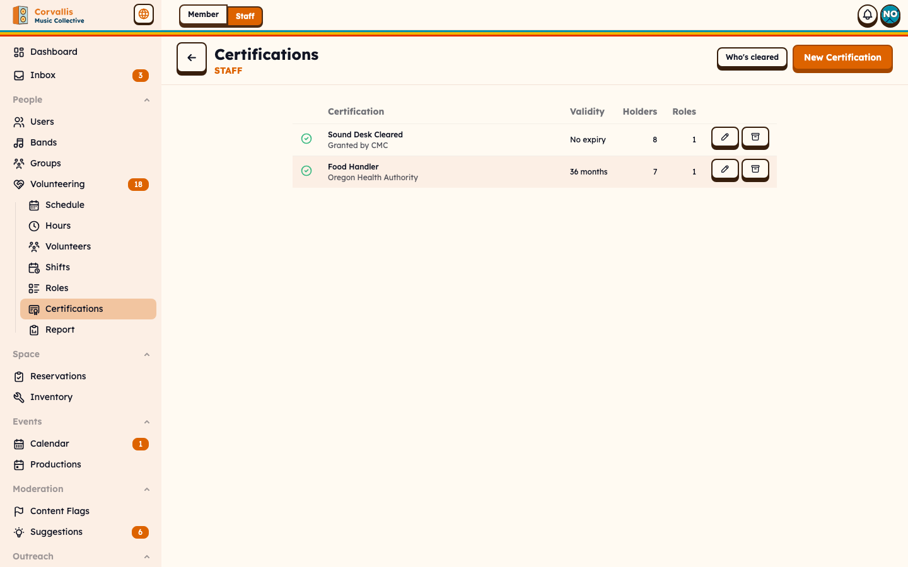
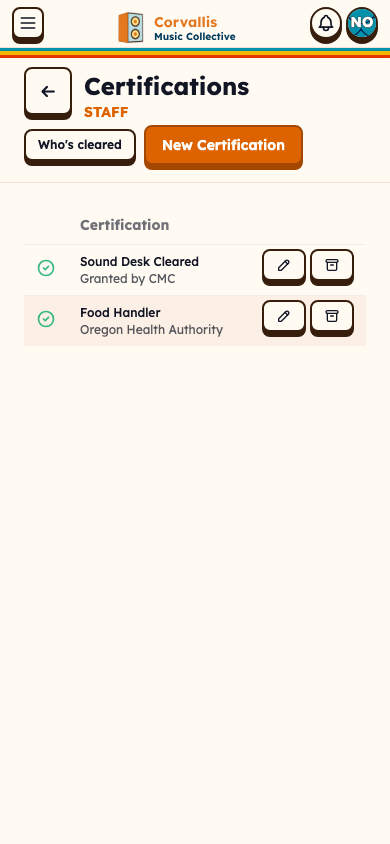

`src/routes/staff/volunteer/certifications/+page.svelte` · `requireStaff` ·
`getCertifications`, `createCertification`, `updateCertification`, `archiveCertification`,
`restoreCertification`, `deleteCertification`

**Who/what/where/when/how.** The clearance catalog — the _kinds_ of thing somebody can hold,
as opposed to who holds them, which is screen 20. Per row: name, who issues it (blank means
internal, and renders "Granted by CMC"), how long it is valid for, how many people hold it,
and how many roles require it. `validityMonths` is the load-bearing field: it is what stamps
an `expiresAt` at grant time, and a certification with none never lapses. Staff touch this
page rarely — when a new requirement appears, or a card's validity period changes.

**User stories.**

- As staff, I want to define a clearance once and attach it to any role, so that the
  requirement lives in one place.
- As staff, I want an internal sign-off and an external card to be the same kind of thing, so
  that "cleared for the desk" and "food handler" are managed together.

**What the seed is showing.** Two certifications: Sound Desk Cleared (CMC, no expiry, 8
holders, 1 role) and Food Handler (Oregon Health Authority, 36 months, 7 holders, 1 role).

**Known friction.** The **shortest page in the module** — 218 characters of content — and one
of the two nav children nothing else links to (D2). E records the clearance model itself as
sound: append-only grants, revoke rather than delete, expiry derived from dates rather than
stored as a status, and `expiresAt` stamped at grant so shortening a validity period cannot
retroactively expire a card that was validly issued.

## 20. Who's Cleared — `/staff/volunteer/clearances`

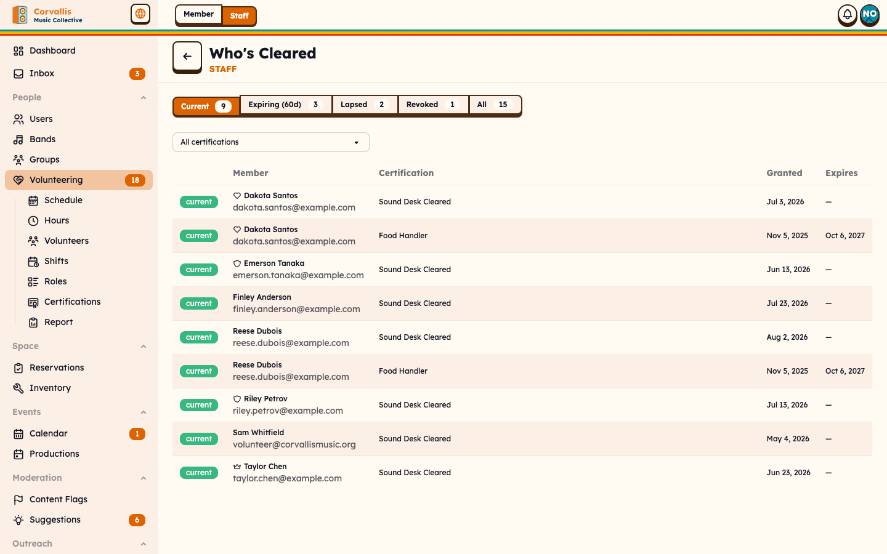
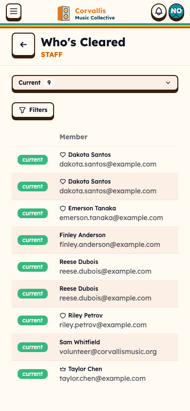

`src/routes/staff/volunteer/clearances/+page.svelte` · `requireStaff` · `getClearancesPage`,
`getActiveCertifications`

**Who/what/where/when/how.** The grants: who holds what, tabbed by a state that is _derived_
rather than stored — Current, Expiring (60d), Lapsed, Revoked, All — with a certification
filter. Reached from the Certifications header, not from the nav. Rows carry the member, the
certification, when it was granted and when it expires. There is no status column in the
database; the tabs are computed from `expiresAt` and `revokedAt`, which is what lets a
renewal simply append a newer grant.

**User stories.**

- As a coordinator, I want a list of cards expiring in the next two months, so that I can
  chase them.
- As a coordinator, I want to see that a clearance was revoked and why, so that "was their
  sign-off current on the night" has an answer.

**What the seed is showing.** All five tabs populated — 9 current, 3 expiring, 2 lapsed, 1
revoked, 15 all. The revoked row is the coordinator's own desk clearance, pulled after a
console swap.

**Known friction.** C1 (**✅ fixed**) — nothing used to push this page: no badge, no card, no
cron, so a lapsing clearance was a tab you had to remember to open. Screen 10's lapsing card
is the fix, and it asks the better question: not "who expires soon" but "whose card lapses
before a shift they are already on". This page remains the browsable version, and remains
reachable from exactly one place.

## 21. Volunteer Report — `/staff/volunteer/report`

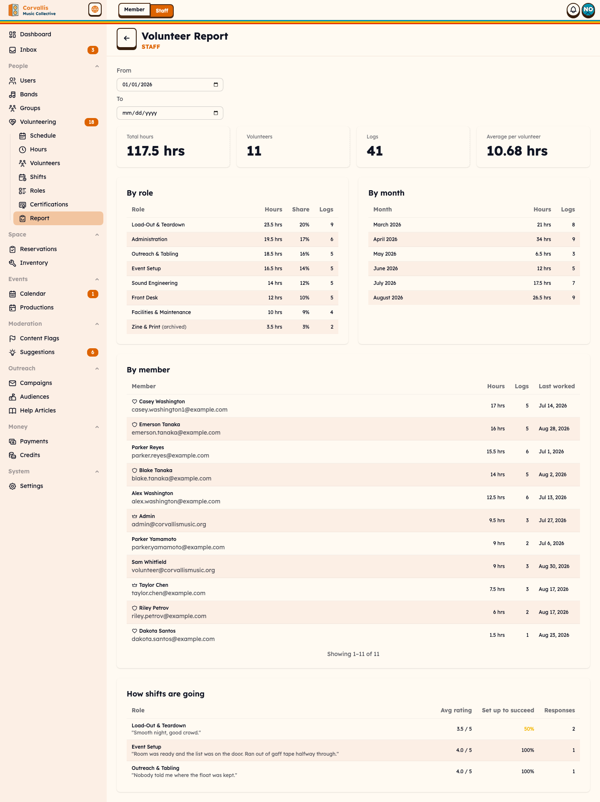
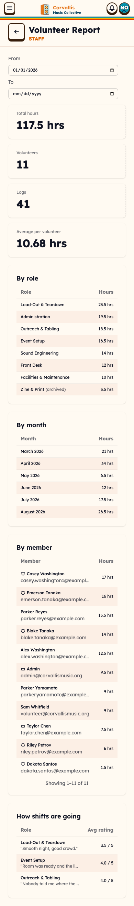

`src/routes/staff/volunteer/report/+page.svelte` · `requireStaff` · `getVolunteerReportPage`
(wrapping `getVolunteerReport`, `getFeedbackByRole`, `getVolunteerReportByMember`)

**Who/what/where/when/how.** The number the board and grant applications ask for. A date range
defaulting to January 1st through today, four totals (hours, volunteers, logs, average per
volunteer), then hours by role with a share percentage, by month, and by member with a last-
worked date and pagination. At the bottom, **How shifts are going** — the anonymous per-role
feedback rollup, average rating and "set up to succeed" percentage with a sample comment.
Opened quarterly, or the week a grant is due. Every figure filters to `status = 'approved'`,
which is the entire reason the review step exists.

**User stories.**

- As a board member, I want total volunteer hours for a period, so that the annual report has
  a defensible number in it.
- As a grant writer, I want hours broken down by the kind of work, so that a proposal can
  describe what the labor actually was.
- As a coordinator, I want to see which roles score badly on "set up to succeed", so that I
  fix the briefing.

**What the seed is showing.** 117.5 hours across 11 volunteers and 41 logs; eight roles
including the archived Zine & Print, which proves retired roles still resolve in history; six
months of history; and per-role feedback with Load-Out & Teardown at 50% on "set up to
succeed", which is the warning threshold.

**Known friction.** None found. Note for a wireframe: this is the one screen in the module
whose audience is not staff — it exists to be read out, or pasted into something else, and
nothing about it currently acknowledges that.

## 22. Volunteer tab on a member — `/staff/users/[id]?tab=volunteer`

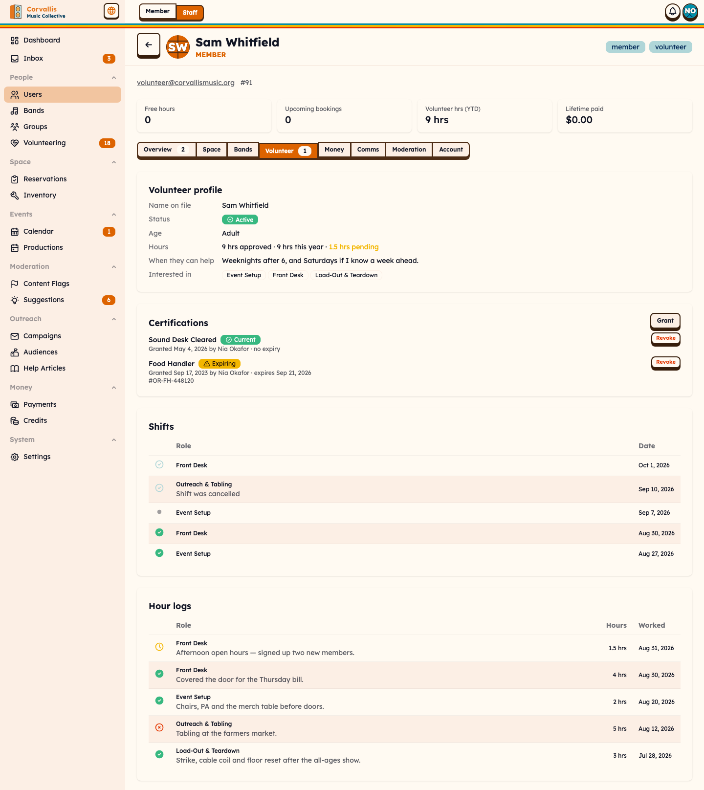
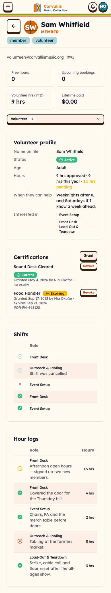

`src/routes/staff/users/[id]/panels/VolunteerPanel.svelte` · `requireStaff` ·
`getUserVolunteerProfile`, `getUserShifts`, `getUserHourLogs`, `getMemberCertifications`,
`grantCertification`, `revokeCertification`

**Who/what/where/when/how.** One person's whole volunteering record, inside the staff user
page rather than the volunteering section — which is the right home, because the question
"what is Sam's story" is a question about Sam. Four blocks: the volunteer profile (name on
file, status, adult flag, hours, availability, interests), Certifications with grant and
revoke, Shifts with their statuses including "Shift was cancelled", and Hour logs. This is
the only screen where a clearance is actually granted.

**User stories.**

- As a coordinator, I want to grant somebody their desk clearance the moment I sign them off,
  so that they can claim the shift today.
- As a coordinator, I want to revoke a clearance with a reason, so that the record says why.
- As staff handling a complaint, I want one person's shifts and hours in one place, so that I
  am not cross-referencing three tables.

**What the seed is showing.** Sam Whitfield: active adult, 9 hrs approved / 9 this year / 1.5
pending, availability and three interests, two certifications (one Current, one Expiring, both
"Granted by Nia Okafor"), five shifts including the cancelled one, and five hour logs across
every status.

**Known friction.** None specific. Worth noting for the wireframe that this panel duplicates,
in miniature, what screens 12, 13 and 20 each show a slice of — and it is the only one that
shows them together.

## 23–31. The coordinator's nine modals

### 23. Schedule a shift

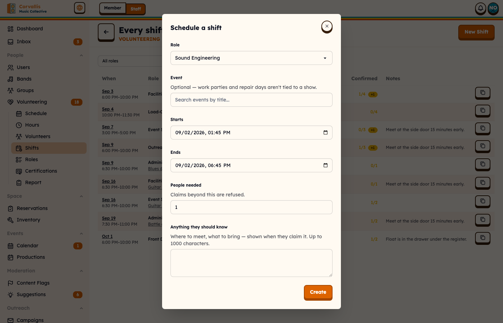
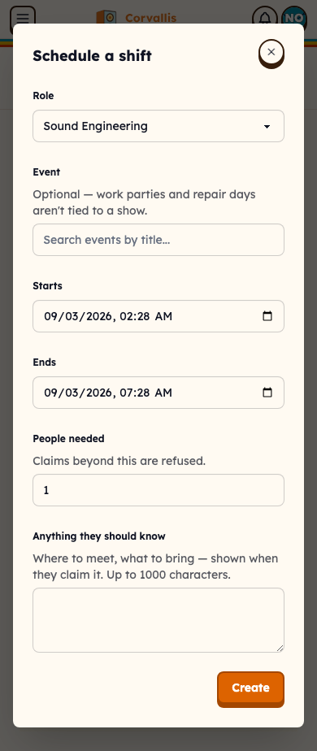

Opened from **New Shift**, which appears in the header of `/staff/volunteer`,
`/schedule`, `/shifts` and the role page · `createShift`

Role, start, end, capacity, notes, and an optional event search — most shifts staff a show,
but work parties and gear-repair days are why `eventId` is nullable. Picking a role reseeds
the duration and capacity from that role's defaults, which is what the shift-defaults fields
on screen 18 are for. **As a coordinator, I want scheduling a Front Desk shift to start from
what a Front Desk shift usually is, so that I am typing one number instead of four.**

### 24. Add someone to {role}

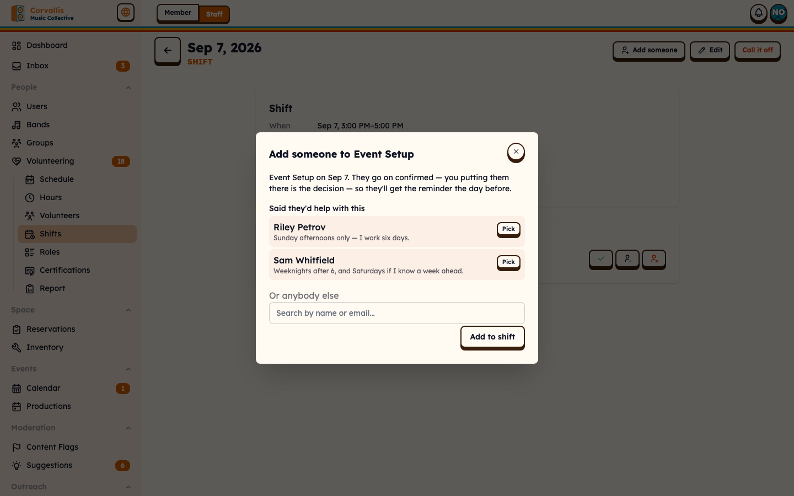
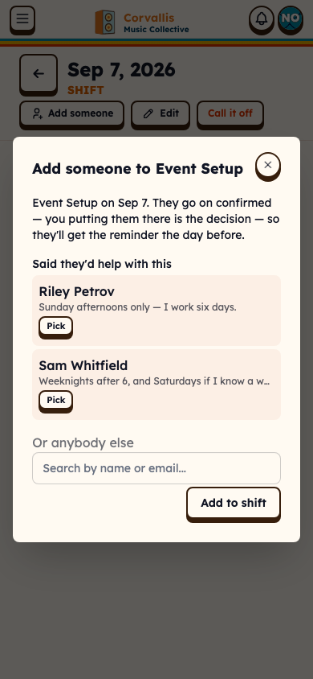

Opened from **Add someone** on a shift, and from the add button on screen 10's short-staffed
rows and screen 11's schedule rows · `assignShiftToMember`, `getInterestedVolunteers`

Opens on the people who said they were interested in this role, with an "Or anybody else"
search behind it. The signup lands **`confirmed`**, not `claimed` — a coordinator typing the
name in _is_ the decision, and leaving it claimed would cost the member their reminder. The
clearance gate is **not** relaxed for staff: an uncleared member is refused with the
certification named. **As a coordinator, I want to put down the person who told me in the
hallway, so that a verbal yes becomes a booking.**

### 25. Confirm {name}?

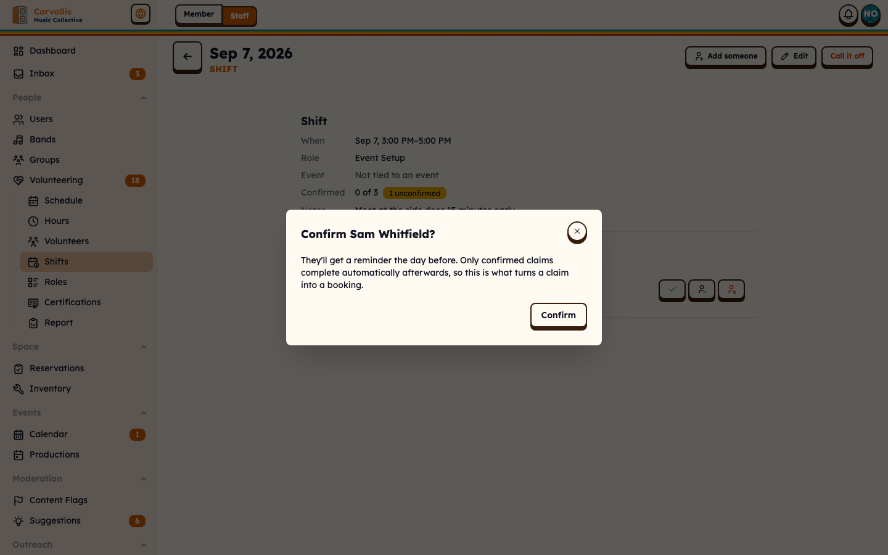
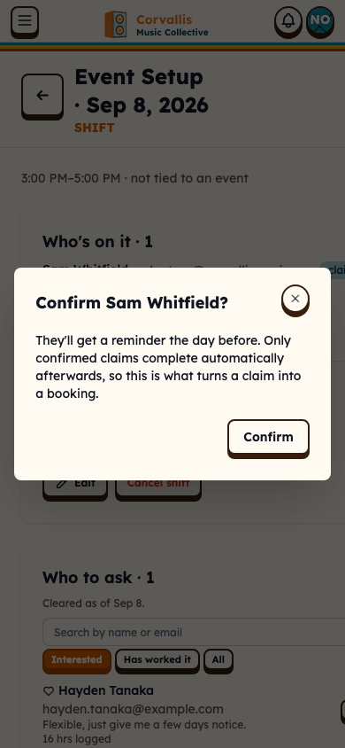

Opened from **Confirm** on a claimant row, on the shift page and on screen 10 · `confirmSignup`
(and `confirmSignups` for the confirm-all variant)

The smallest dialog in the module and the most consequential. Confirming is what earns the
day-before reminder and the auto-complete, and only a completed signup produces the pre-filled
hour log and the feedback request. **As a coordinator, I want confirming to be one click from
wherever I noticed the claim, so that the thing everything else depends on is the easiest
thing on the page.**

### 26. Edit this shift

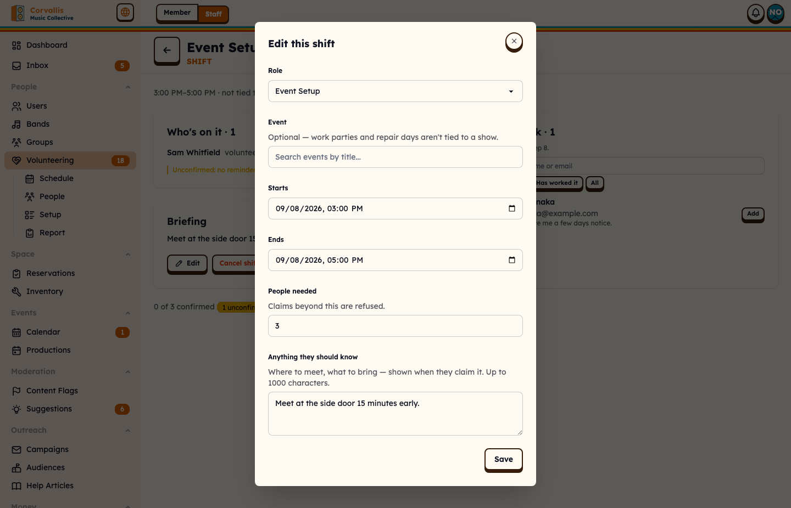
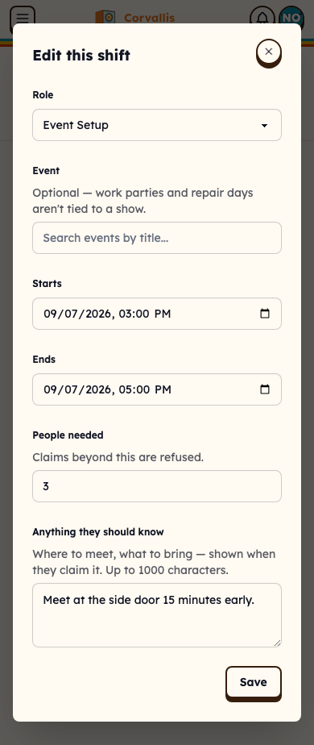

Opened from **Edit** on a shift · `updateShift`

The same field set as screen 23, populated. Capacity can be raised or lowered under people who
are already on the shift, which is the interesting case for a wireframe: nothing here shows
what the change does to the roster. **As a coordinator, I want to move a shift an hour later
without cancelling and re-creating it, so that everybody on it stays on it.**

### 27. Approve these hours?

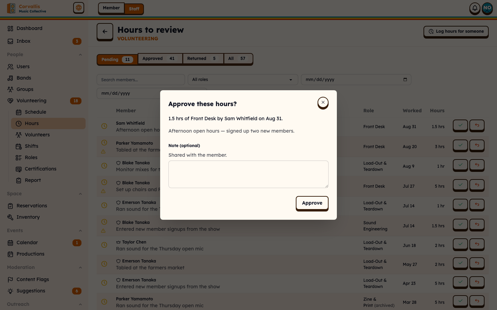
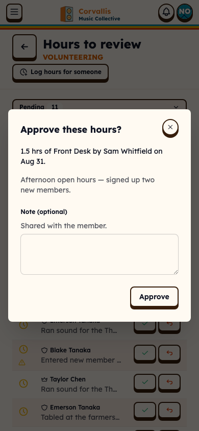

Opened from **Approve** on any pending log, on screen 12 and on screen 10 ·
`approveVolunteerHours`

Restates the log and offers an optional note. Approval is what makes a number reportable.
**As a coordinator, I want approving to be a glance and a click, so that a queue of thirty is
not an afternoon.**

### 28. Return these hours?

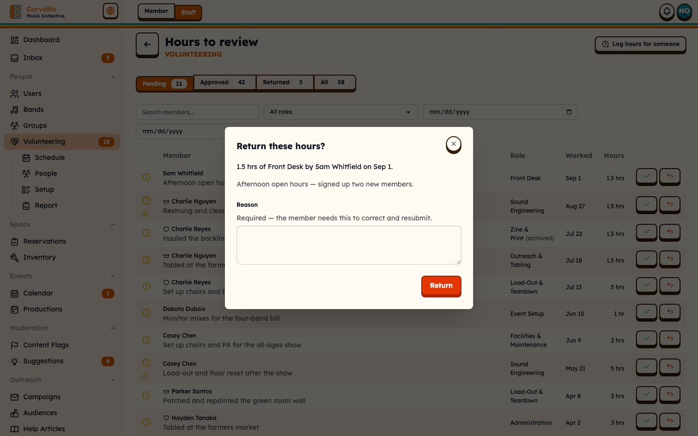
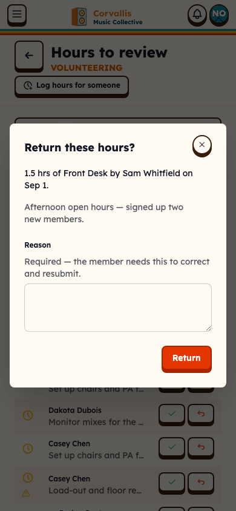

Opened from **Return** on any pending log · `rejectVolunteerHours`

The reason is **required**, and the member sees the status as "Returned" rather than
"Rejected" — the whole point is that it is a request for a correction. **As a volunteer, I
want to be told what was wrong with my log, so that I can fix it rather than give up.**

### 29. Log hours for a member

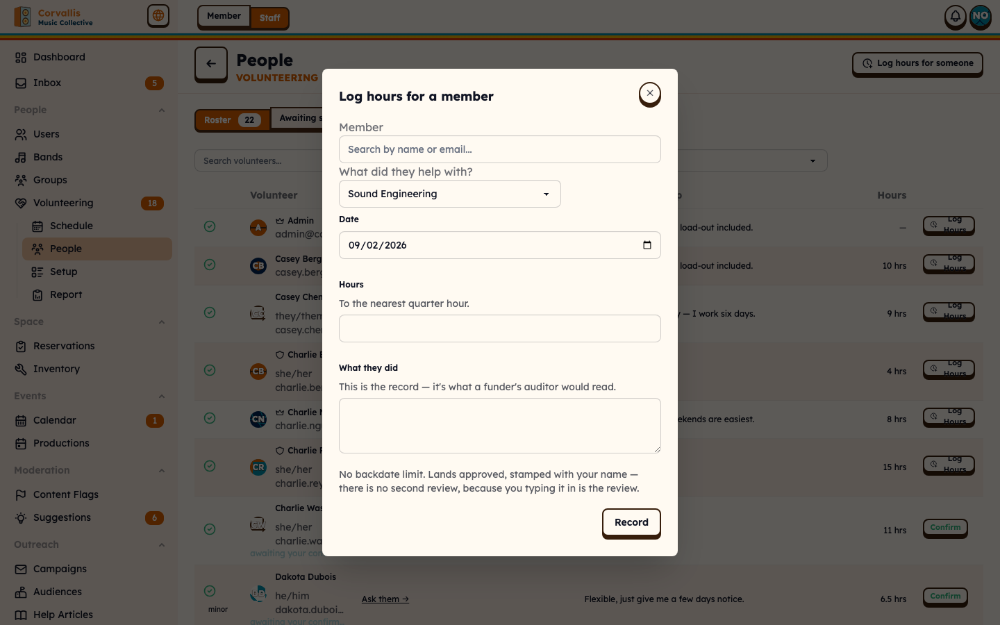
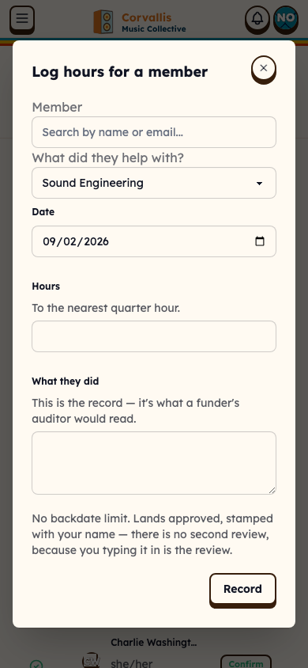

Opened from **Log hours for someone** on screen 12, and from "They worked it" on screen 10's
close-out card · `logHoursForMember`

Member, role, date, hours, description. The 90-day backdate limit is **lifted** here and the
log lands `approved`, stamped with the staffer who entered it. This is the fix for B1: the
help article and the service's own error message both tell members to ask staff for anything
older, and for the module's first year staff could not. **As a coordinator, I want to record
the hours of the volunteer who does not use the app, so that the report is the whole story.**

### 30. New volunteer role

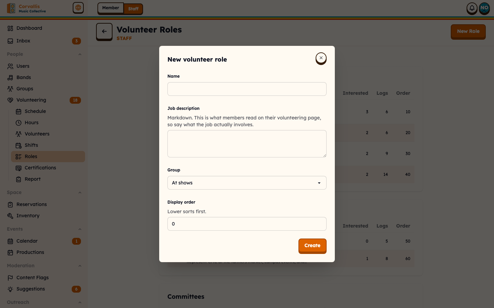
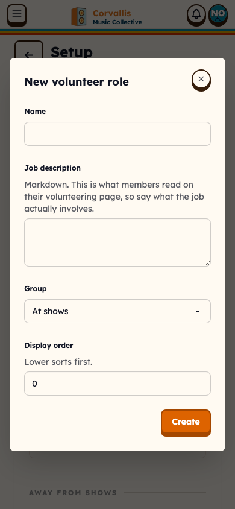

Opened from **New Role** on screen 17 · `createVolunteerRole`

Name, markdown job description, group, display order, and the two shift defaults. The
description field's own helper text says what it is for: _this is what members read on their
volunteering page, so say what the job actually involves_. **As staff, I want to add a role
and describe it in the same breath, so that it does not go live as a bare name nobody
understands.**

### 31. Grant a certification

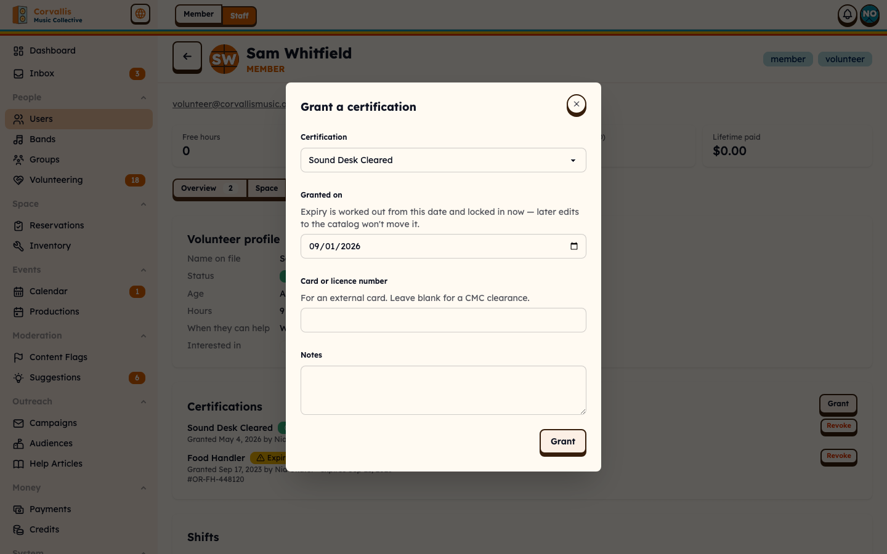
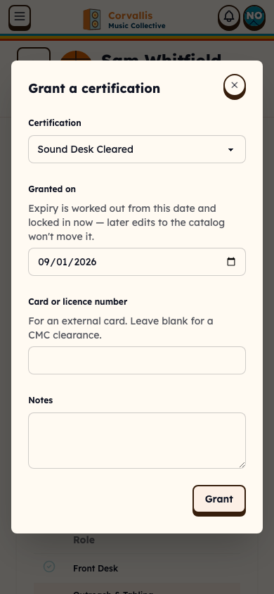

Opened from **Grant** on screen 22 · `grantCertification`

Certification, granted-on date, card or licence number, notes. `expiresAt` is **stamped here**
from the certification's `validityMonths` and never computed on read, which is what makes a
validly-issued card stay valid if the policy later changes. Grants append rather than
overwrite, so a renewal is a new row and the history survives. **As a coordinator, I want to
record a food handler card with its number, so that "was their card current on the night" has
an answer a year later.**

---

# What a wireframe pass should decide

The findings report's three blocking problems have been fixed in code. What it diagnosed
underneath them has not been touched: **the member's half was designed, and the coordinator's
half was inferred from it.** `/staff/volunteer` is now a worklist, which is the shape the
report argued for — but the other eleven staff screens are still the entity list, and the nav
is still five nouns and a report.

Open questions, in the order they cost the most:

1. **The nav is the schema.** Schedule · Hours · Volunteers · Shifts · Roles · Certifications
   · Report. Screen 10 proves the job can be expressed as decisions; nothing below it is.
2. **Sub-navigation disagrees with itself** (D2, open). Every page builds its own header links
   by hand and no two agree — Certifications is linked from the header of no page at all, and
   Clearances only from Certifications. The sidebar already carries all of them.
3. **"Who can I ask" is on the role page, and the question is always about a shift** (A5,
   open) — and the readiness it reports is computed against today rather than the shift date
   (A7, open), which stopped being cosmetic the moment an add-to-shift action landed on the
   same rows.
4. **The member's dashboard is five sections in one column** (screen 4), and on a phone the
   shift board alone is most of the scroll. It is the screen a volunteer actually uses.
5. **A claim does not tell the member it is not yet a booking** (screen 9). The coordinator
   side now has three ways to find out; the member has none.
6. **Interest is opt-in and mostly empty** (screen 13). Thirteen of nineteen roster rows read
   `—` under "Interested in". Either the column earns its width or the funnel does.
7. **A cancelled shift keeps its roster** (screen 16), correctly, and looks wrong doing it.
8. **Raw markdown leaks into the staff roles table** (screen 17). Small, real, visible in the
   screenshot.

## Regenerating this

```bash
pnpm db:reset
```

Then start the dev server for this checkout (`pnpm dev`, on the port `pnpm worktree:ports`
reports) and:

```bash
pnpm screens:volunteer
```

`scripts/capture-volunteer-screens.ts` holds the manifest — 31 screens, two viewports, the
persona each one is shot as, and a `ready` selector per screen. It fails loudly rather than
saving a blank page, and `ONLY=staff-hours,member-start pnpm screens:volunteer` re-shoots a
subset.
