# Volunteering: every screen, and what it is for

> A visual inventory. Every volunteer screen, shot from a populated local seed at desktop and
> mobile, with the who/what/why of the person looking at it.
>
> Companion to [volunteer-workflow-findings.md](volunteer-workflow-findings.md) (what was wrong
> with the shape), [../specs/shipped/volunteering-spec.md](../specs/shipped/volunteering-spec.md)
> (why the model is what it is),
> [../specs/shipped/volunteering-redesign-spec.md](../specs/shipped/volunteering-redesign-spec.md)
> (why the surfaces are shaped the way they are), and
> [../development/business-workflows.md](../development/business-workflows.md#12-volunteering)
> (how it behaves today).
>
> **Status: current as of the screenshots below — the shipped redesign.** Regenerate them with
> `pnpm db:reset`, then a dev server, then `pnpm screens:volunteer`.

## Why this exists

The findings report argued that the coordinator's half of volunteering was shaped like the
database — a table of hour logs, a table of volunteers, a table of shifts, a catalog of roles, a
catalog of certifications, a report — when the job is shaped like a list of decisions.

The first edition of this document was the seeing that made the redesign possible: thirty-one
screens, populated, side by side, with enough context to redraw. That pass has now happened, so
this edition documents what was built rather than what was there to be replaced. **The
pre-redesign entries are in git history** — `git log --follow docs/reports/volunteer-view-handoff.md`
— and are worth reading beside the findings report if you want to know what a screen used to be.

## What volunteering is

CMC runs on volunteer labor and the module gives it a home. Staff define **roles** — job types
with markdown descriptions, like Sound Engineering or Front Desk. Members say which roles interest
them (a standing note, not a commitment to a date), claim dated **shifts**, and log **hours**.
Staff work an approval queue, and a date-ranged report rolls approved hours up by member, role and
month — the number the board and grant applications ask for.

Three rules run through every screen:

- **Approved hours are a record, not a currency.** They never become practice-room credits and
  never touch the finance ledger.
- **Certifications gate scheduling, never the record of work already done.** Whether a member held
  one is evaluated as of the _shift's_ date, not today's.
- **Confirmation is load-bearing.** Only a `confirmed` signup earns the day-before reminder and the
  auto-complete; only a `completed` signup produces the pre-filled hour log and the feedback
  request. A claim nobody confirms silently produces none of it — which is why both halves of the
  app now draw claimed and booked as separate states.

## The vocabulary a screen must use

All of it lives in `src/lib/config.ts`. Two labels deliberately differ from the stored value, and
getting them wrong changes what the screen means:

| Concept         | Values                                                      | Note                                                                                |
| --------------- | ----------------------------------------------------------- | ----------------------------------------------------------------------------------- |
| Signup status   | `claimed`, `confirmed`, `completed`, `cancelled`, `no_show` | Mirrors reservation statuses on purpose                                             |
| Hour-log status | `pending`, `approved`, `rejected`                           | **`rejected` renders as "Returned"** — a request for a correction, not a judgement  |
| Profile status  | `active`, `blocked`                                         | **`blocked` renders as "Needs review"** — its only cause is an under-18 self-signup |
| Role group      | `at-shows`, `away-from-shows`, `committee`                  | Presentational grouping only                                                        |

Hours are stored as integer minutes and rendered by `formatVolunteerHours` — "3 hrs" for a whole
number, "1.5 hrs" otherwise. Dates worked are anchored at **noon club time**, which is why nothing
in this module has the month-boundary bug.

## The four demo logins

`pnpm db:reset` seeds these, all with the password `password`. Three of the member-facing pages are
gated on onboarding stage and those states are mutually exclusive per user, so seeing the member's
half takes three accounts.

| Login                            | Who they are                           | What they reach                                           |
| -------------------------------- | -------------------------------------- | --------------------------------------------------------- |
| `coordinator@corvallismusic.org` | Nia Okafor, `staff`                    | Every `/staff/volunteer` page, without the admin-only nav |
| `volunteer@corvallismusic.org`   | Sam Whitfield, active volunteer        | The dashboard, hours, interests, and the shift survey     |
| `newcomer@corvallismusic.org`    | Ellis Park, no volunteer profile       | `/member/volunteer/start`                                 |
| `minor@corvallismusic.org`       | Robin Vance, under 18, awaiting review | `/member/volunteer/blocked`                               |

## Route map

| URL                                     | Who         | Note                                           |
| --------------------------------------- | ----------- | ---------------------------------------------- |
| `/member/volunteer`                     | Member      | Next-action stack beside the claim board       |
| `/member/volunteer/hours`               | Member      | The whole log history                          |
| `/member/volunteer/interests`           | Member      | Onboarding step two, and the editor after      |
| `/member/volunteer/start`               | Member      | Stage `none` only                              |
| `/member/volunteer/blocked`             | Member      | Stage `blocked` only                           |
| `/member/volunteer/feedback/[signupId]` | Member      | Ownership-gated                                |
| `/staff/volunteer`                      | Coordinator | **Today** — the worklist                       |
| `/staff/volunteer/schedule`             | Coordinator | Absorbed the shift catalog                     |
| `/staff/volunteer/people`               | Coordinator | Roster · Awaiting sign-off · Cleared           |
| `/staff/volunteer/setup`                | Coordinator | Roles and clearances, side by side             |
| `/staff/volunteer/report`               | Coordinator | Read-only                                      |
| `/staff/volunteer/shifts/[id]`          | Coordinator | Unlisted; reached from Today and Schedule      |
| `/staff/volunteer/roles/[id]`           | Coordinator | Unlisted; reached from Setup                   |
| `/staff/volunteer/hours`                | Coordinator | Unlisted; the full queue, reached from Today   |
| `/staff/users/[id]?tab=volunteer`       | Coordinator | One member's volunteering, on their own record |

Retired and redirecting: `/staff/volunteer/shifts` → Schedule, `/staff/volunteer/clearances` →
People's Cleared tab, `/staff/volunteer/roles` and `/staff/volunteer/certifications` → Setup,
`/staff/volunteer/interest` → People.

Remote functions are the security boundary: every one of these pages gets its data from
`src/lib/remote/volunteer.remote.ts`, which guards first and takes its params from a client header.
A guard in a layout guards nothing.

---

# Part one — the member

## 1. Volunteering — `/member/volunteer`


A next-action stack on the left, the claim board on the right.

The left column is only what is owed or pending, in that order: **Hours to log** (the one accented
card, because it is the only genuinely outstanding thing — they did the work and the record does
not exist until they say what it was), **Your shifts**, then three summary rows that link out.

Each shift card carries a two-step **Claimed → Booked** rail with only the reached step lit. That is
the whole point of the screen: a claim nobody confirms earns no reminder and never auto-completes,
and before this the person who made it could not tell that from a booking. A claimed shift reads
"Awaiting staff confirmation."; a booked one shows the briefing and "Reminder lands the day before."
The rail withdraws once the shift is worked.

The board is filtered to the roles they said they would take, with `Show all` one press away and a
subline saying which of the two they are reading. "Nobody on it yet" replaces "0 of 4 filled" — it
is an ask, not a statistic. A shift they cannot take is shown with the reason rather than hidden,
because "you need Food Handler" is the useful half of a refusal.

## 2. Your hours — `/member/volunteer/hours`

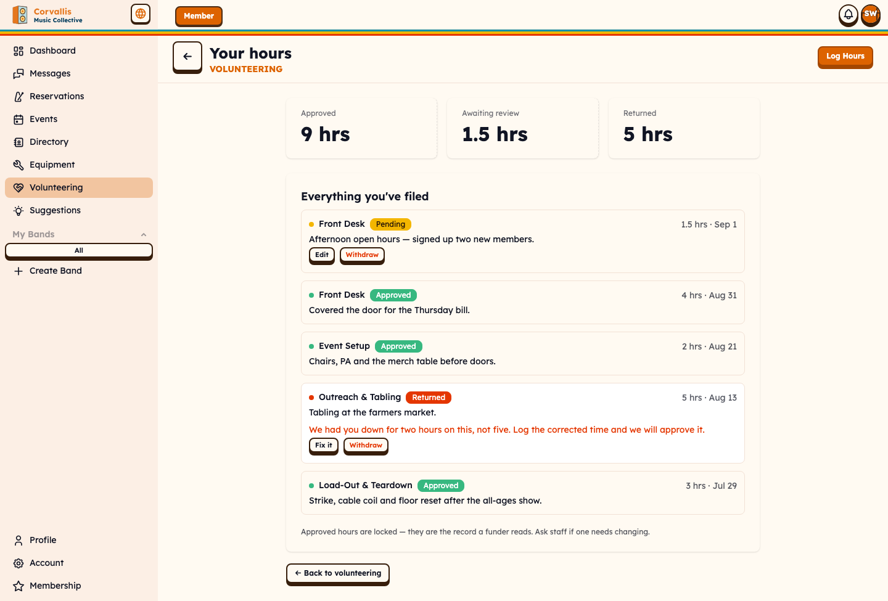
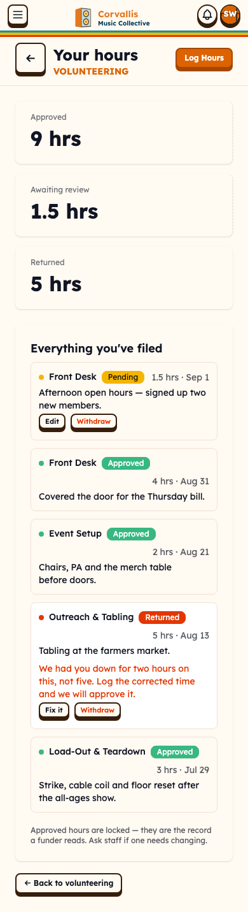

Three tiles — Approved, Awaiting review, Returned — then every log, newest first.

Split off the dashboard because a log filed in March is not a next action. The one state that **is**
— a returned log — was buried under everything already approved; here it is tinted, carries the
staff reason in full, and offers `Fix it`. Approved logs are locked and the page says why.

## 3. Select the roles you'd take — `/member/volunteer/interests`


Framed as information rather than commitment: "Not a commitment. It tells staff who to ask, and
we'll show you how the job is done." Roles are grouped exactly as Setup groups them.

Its own screen rather than a modal over the board — it is the same length as the board it filters,
and a dialog that tall is a page in a costume. It reads onboarding or editing from whether anything
is selected: `Skip` and `Finish` the first time, `Back` and `Save` after.

## 4. Volunteer with CMC — `/member/volunteer/start`


Asked once, and it says so. Phone carries the reason it exists ("For shift-day contact.") and is
required here while staying optional on the edit form — signing up without a number leaves a
coordinator unable to reach somebody who is on tonight, but requiring it on the edit form would lock
every existing member out of their own profile.

The age answer is a **select, not a checkbox**: an unticked box submits nothing, so "I am under 18"
and "I skipped this" would arrive identically, and either default is wrong for somebody.

## 5. Almost there — `/member/volunteer/blocked`


Where an under-18 sign-up lands. Deliberately terminal — no form, no retry, no way to re-answer the
age question — because volunteering with minors involves paperwork and a conversation that does not
belong in a web form.

The one screen in the app that addresses the member directly, and deliberately so: it leads with the
welcome rather than the block, says what the paperwork is, says a staff member will walk them
through it, and says there is nothing to chase on their end. Describing a blocking state
impersonally reads as a rejection, which this is not. Staff clear them from Today, which is the only
route back.

## 6. How did it go? — `/member/volunteer/feedback/[signupId]`


Three questions, one of them the only one that matters. The rating is required; "I knew what to do
and had what I needed" is framed as "Used to fix the briefing, not to assess you."; the comment is
"Sent to staff without your name on it."

The confirmation differs by answer. Somebody who has just reported they were not set up to succeed
is not thanked in the same words as somebody who was — the first is a complaint, and acknowledging
it is the least the form owes them.

## 7–11. The member's five modals

|                                                                                                                                                                                                                                                     |                                                                     |
| --------------------------------------------------------------------------------------------------------------------------------------------------------------------------------------------------------------------------------------------------- | ------------------------------------------------------------------- |
| **Claim this shift?** — the three-step rail with only "You claim it" lit, then the consequence: not booked until staff confirm, usually within a day; email then, and a reminder the day before; drop out any time. The briefing is quoted beneath. |      |
| **Drop out of this shift?** — separates notice from absence. "Notice isn't a no-show. The place goes back on the board for someone else."                                                                                                           | 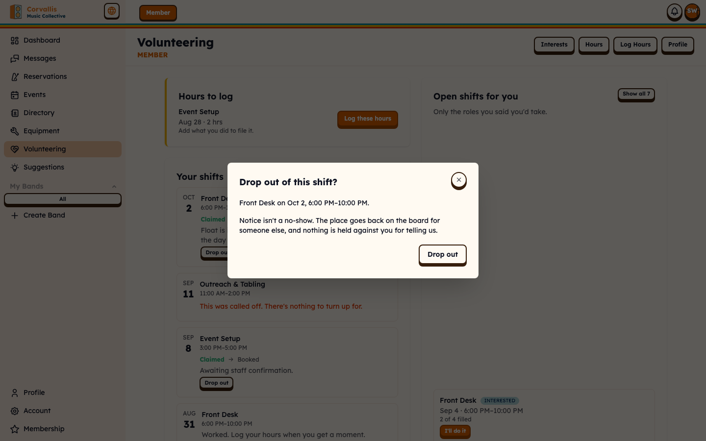        |
| **Log hours**, free entry — asks which role first, since nothing else knows.                                                                                                                                                                        |        |
| **Log these hours**, pre-filled from a worked shift — "Pre-filled from the shift. Adjust if it differs." No role picker: the button already answered that.                                                                                          |  |
| **Your volunteer profile** — the only editor of the volunteer record's name, pronouns and phone. Deliberately kept as a header action the redesign did not list, because nothing else covers it.                                                    | 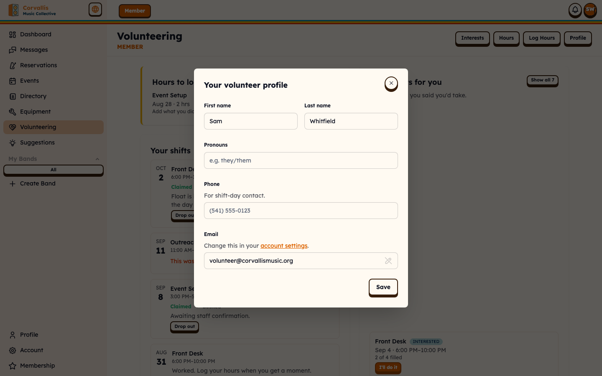         |

Mobile shots for each are alongside, as `*-mobile.png`.

---

# Part two — the coordinator

## 12. Today — `/staff/volunteer`

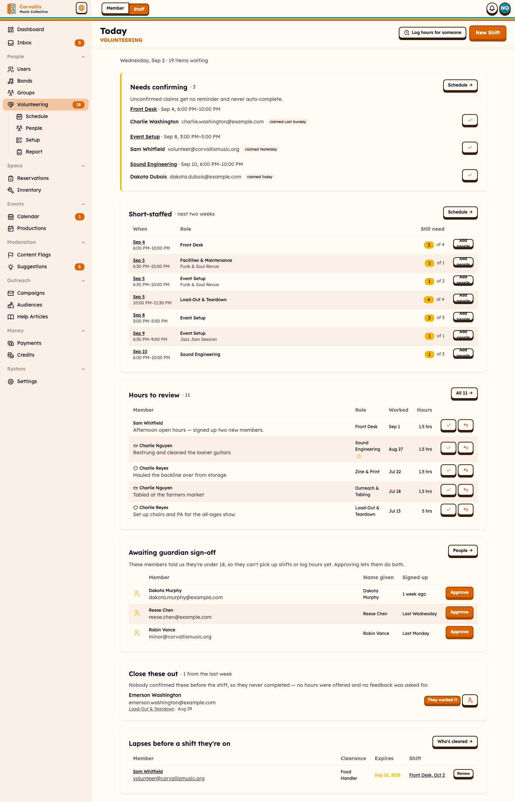
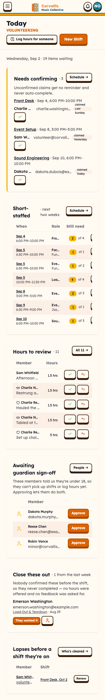

The worklist. "Wednesday, Sep 2 · 19 items waiting" is the line that turns a list into a shift.

Six cards in fixed priority order, each **hidden when its queue is empty**, so a card on screen
always means somebody is waiting: claims to confirm (the only accented one, carrying "Unconfirmed
claims get no reminder and never auto-complete."), short-staffed shifts inside two weeks, the top of
the hours queue, under-18 approvals, shifts that finished without being closed out, and clearances
lapsing before a shift somebody is already booked on. Every action is on the row, in a modal — no
navigation to finish a task — and every card links to the screen it summarises.

When all six are empty, one card says so and names the three queues it is claiming are clear.

## 13. Schedule — `/staff/volunteer/schedule`


Shifts grouped by day, with a window control, a role filter and a short-staffed toggle.

Staffing reads "C of cap · N unconfirmed", toned teal when booked, amber when hands are up that
nobody has confirmed, orange when nobody is confirmed at all. A shift with nobody on it gets the
whole row rather than a number. One subline resolves to the show it staffs, else the briefing, else
"not tied to an event" — which is information, not a blank.

Cancelled shifts leave the list and surface below a divider with what is left to do about them:
"Sep 10 Outreach & Tabling cancelled · 1 to notify".

### 13b. Everything — `?days=all`

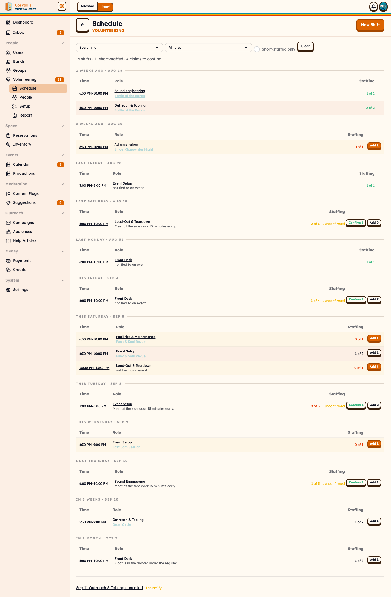
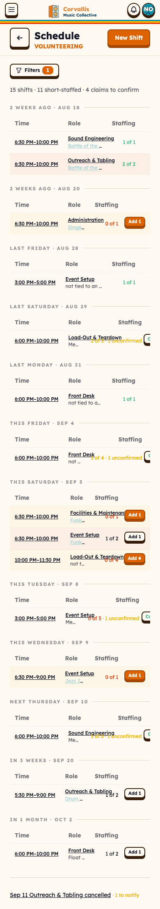

The window control's fourth option drops both date bounds. This is what the retired
`/staff/volunteer/shifts` catalog was, in the page that groups by day and marks today.

## 14. Shift detail — `/staff/volunteer/shifts/[id]`


Two columns: who is on it, and who to ask.

The roster gives each `claimed` person an inline strip reading "Unconfirmed: no reminder, no
auto-complete." with a Confirm beside it. Below it, the briefing — or "No briefing yet — add one and
claimants see it before they commit." — then Edit and Cancel shift.

**Who to ask** is the shortlist that used to live on the role's page, a navigation away from the
shift being filled and judged against _today_ rather than the shift's date. It says which date it
judged, offers three scopes (Interested / Has worked it / All) and a search for the person who
walked up to the desk, and gives each candidate exactly **one** flag line resolved in priority
order: a missing clearance blocks and refuses by name; a clearance lapsing soon after the shift
warns; a day their stated availability argues against warns; otherwise what they have done before.
`Add` puts them on **confirmed** — a staff add is a booking, not a claim.

## 15. Shift detail, cancelled


The same page with one column, because its roster is not a roster any more — it is the list of
people who still have to be told. The banner leads with the outstanding count and names who called
it off; the chips read notified / not notified; the buttons read `Mark as notified`, settling to a
non-interactive "✓ Notified". The candidate column and the cancel action withdraw.

## 16. People — `/staff/volunteer/people`


Three tabs over one question asked at three scopes. The **Roster** row answers "who is this" and
"and what, if anything, do I do about them" — one subline resolved by priority (a clearance about to
lapse, else a claim of theirs waiting on staff, else nothing) and exactly **one** action: `Confirm`,
`Chase`, or `Log Hours` pre-filled with them. A row offering all three has not decided what it is
for.

### 16b. Awaiting sign-off

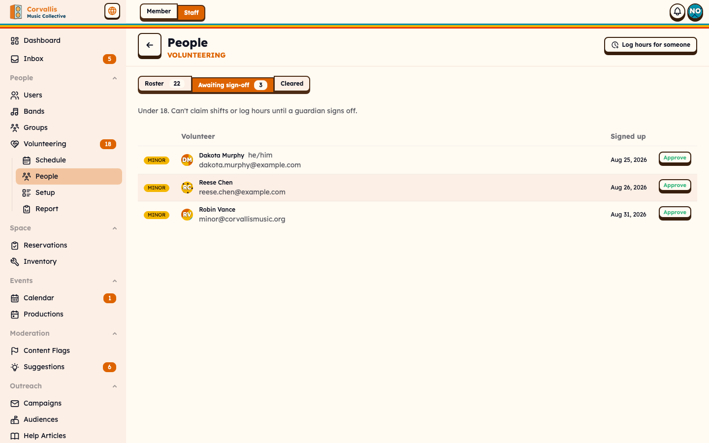
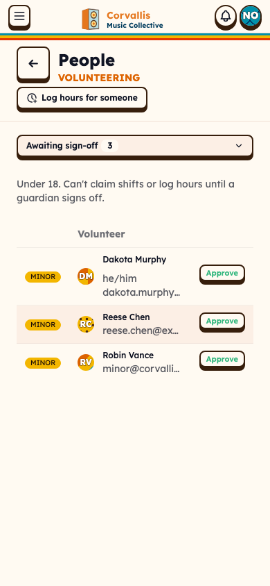

The under-18 queue, which used to be filed under Hours. Approving confirms a guardian has signed
off; the record still says they are under 18, which is what changes how a shift is staffed.

### 16c. Cleared

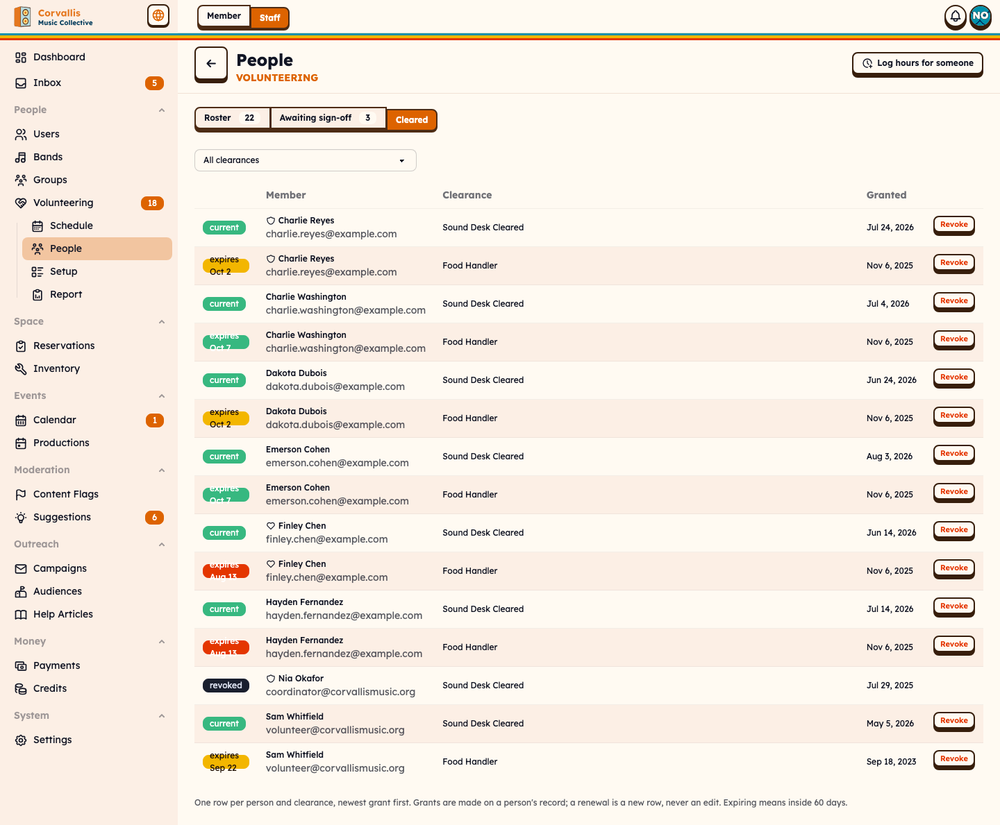
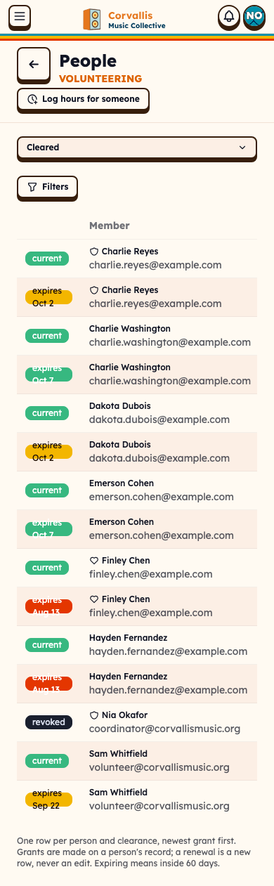

One row per person and clearance, newest grant winning. The chip says the expiry date whenever there
is one — "expiring" with no date makes staff open the row to learn the only thing the chip was for.
Revoking requires a reason and keeps the record of the period it covered, which is the point.

## 17. Setup — `/staff/volunteer/setup`

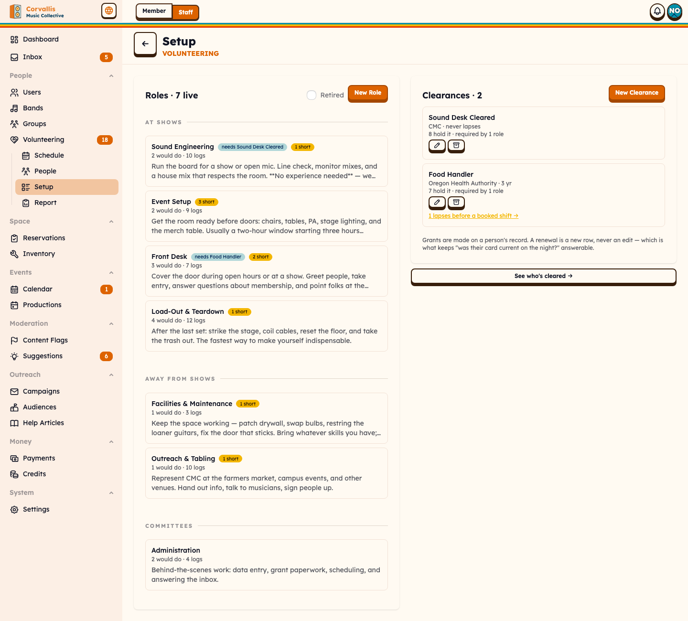
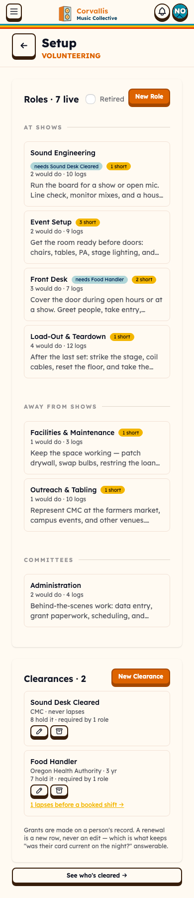

Roles on the left, the clearances that gate them on the right. They were two pages that only ever
got visited together: "needs Food Handler" on the left and "required by 1 role" on the right are the
same sentence read from either end.

Deliberately a browse surface. A role card carries what a coordinator needs to _choose_ one — the
member-facing description, what it requires, how many would do it, how many logs it has, whether it
keeps coming up short — and links to its own page for everything else.

## 18. Role detail — `/staff/volunteer/roles/[id]`


Unlisted, and where a role is actually changed: the edit form, the requirements picker, upcoming
shifts, who is interested and whether they are cleared, and the anonymous feedback rollup. None of
that fits in a Setup column, and `entityHref` resolves every role ref here.

## 19. Report — `/staff/volunteer/report`


Four tiles about the range — Approved hours, Volunteers, Logs, **Still in review** — then one thing
about shape. Everything here is approved-only by design, so without that fourth tile the report
cannot say how much work is waiting to become a number, and "the total is low" and "the queue is
long" are different problems with different fixes.

Hours by role is a sorted bar list because the question is where the labour actually goes, which is
a shape; four columns of digits make you compute it yourself. By-month, by-member and the feedback
rollup sit below — the by-member roll-up is the number the board and grant applications ask for.

## 20. Hours to review — `/staff/volunteer/hours`


Unlisted, and reached from Today's card. The full queue with status tabs, search, role filter and
pagination — a backlog of forty does not fit in the five rows Today shows.

## 21. Volunteer tab on a member — `/staff/users/[id]?tab=volunteer`


One member's whole volunteering history on their own record: profile, certifications with grant and
revoke, shifts, hour logs. Grants are made here, which is why Setup's footnote says so.

## 22–31. The coordinator's ten modals

|                                                                                                                                                              |                                                                                                                              |
| ------------------------------------------------------------------------------------------------------------------------------------------------------------ | ---------------------------------------------------------------------------------------------------------------------------- |
| **Schedule a shift** — role, the role's defaults, when, people needed, and a briefing noted "Shown to claimants before they commit."                         |                                                                  |
| **Edit this shift** — the only way to correct a time or headcount without cancelling and dropping every claim on the floor.                                  |                                                                 |
| **Cancel this shift?** — "Claims and bookings stay in place — they are who you need to notify."                                                              | 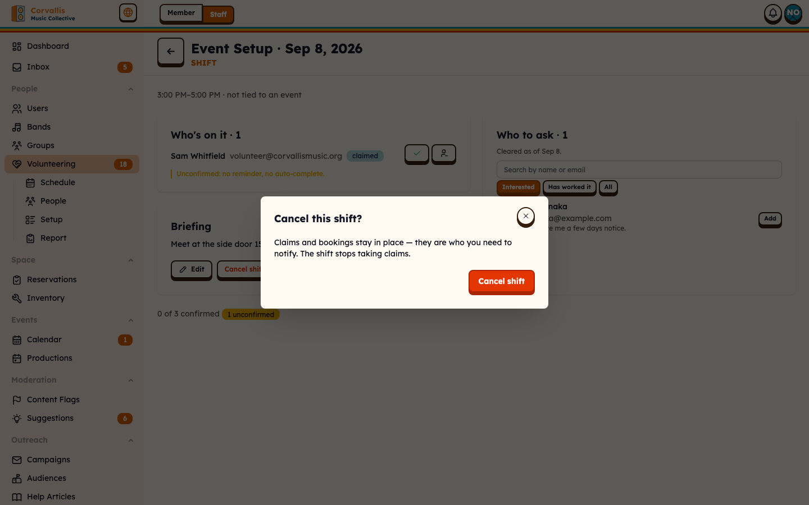                                                              |
| **Tell everybody this is off?** — the mail-out, idempotent, skipping anybody already marked by hand.                                                         | 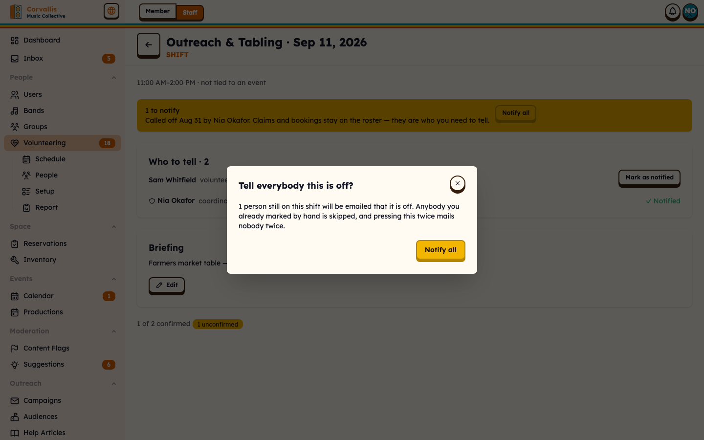                                                          |
| **Confirm** — what turns a claim into a booking, and says so.                                                                                                |                                                             |
| **Approve these hours?** — restates the log and, where flagged, that they were not cleared that day, "which does not block the record of work already done." |                                                              |
| **Return these hours?** — reason required, sent to the member. Not a rejection.                                                                              |                                                               |
| **Log hours for a member** — no backdate limit, lands approved, stamped with the staffer's name.                                                             |                                                       |
| **New volunteer role** / **New clearance** — the two things Setup creates.                                                                                   |  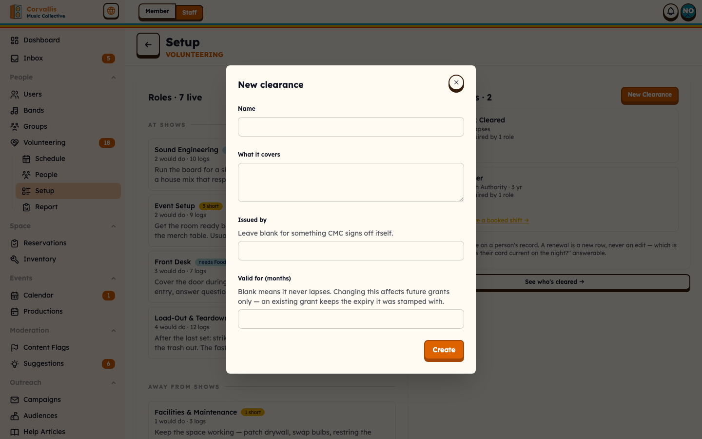 |
| **Grant a certification** — expiry stamped from the granted-on date and locked in; grants append, so a renewal is a new row.                                 |                                                        |

Mobile shots for each are alongside, as `*-mobile.png`.

---

## Regenerating this

```bash
pnpm db:reset
```

Then start the dev server for this checkout — `pnpm worktree:ports` reports which port — and:

```bash
pnpm screens:volunteer
```

`scripts/capture-volunteer-screens.ts` holds the manifest: 35 screens, two viewports, the persona
each is shot as, and a `ready` selector per screen. It gates on real rendered text as well as the
selector, so it fails loudly rather than saving a blank page that looks exactly like a correct empty
state. `ONLY=staff-today,member-start pnpm screens:volunteer` re-shoots just those.

Two things that will otherwise cost an hour: **stop the dev server before `db:reset`** — wiping the
D1 files under a running workerd poisons its miniflare, and every subsequent request 500s with
"Attempted to use poisoned stub" — and remember that a `ready` selector pointing at something inside
`FilterBar` will pass at desktop and time out at mobile, where the filters collapse behind a button
and are absent from the DOM until pressed.
